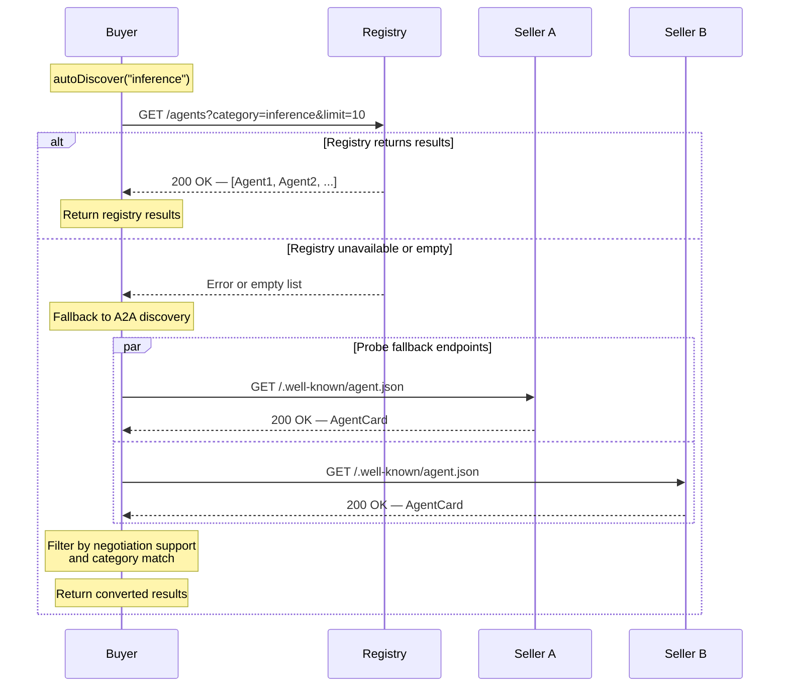

# Ophir Agent Discovery Protocol

**Version:** 1.0
**Status:** Draft
**Date:** 2026-03-05

## Abstract

The Ophir Agent Discovery Protocol defines how buyer agents locate seller agents within the Ophir negotiation ecosystem. Discovery operates across three layers: direct endpoint probing, decentralized A2A Agent Cards served at well-known URIs, and centralized registry queries. This specification describes the format of discovery metadata, the precedence and fallback rules between layers, the auto-discovery algorithm, caching semantics, and security considerations for each mechanism.

---

## Table of Contents

1. [Introduction](#1-introduction)
2. [Terminology](#2-terminology)
3. [Discovery Mechanisms](#3-discovery-mechanisms)
4. [A2A Agent Card Format](#4-a2a-agent-card-format)
5. [Ophir Discovery Extension](#5-ophir-discovery-extension)
6. [Registry-Based Discovery](#6-registry-based-discovery)
7. [Discovery Priority](#7-discovery-priority)
8. [Auto-Discovery Flow](#8-auto-discovery-flow)
9. [Caching](#9-caching)
10. [DNS-Based Discovery](#10-dns-based-discovery)
11. [Security Considerations](#11-security-considerations)
12. [Backwards Compatibility](#12-backwards-compatibility)

---

## 1. Introduction

Before negotiation can begin, a buyer agent MUST locate one or more seller agents that offer the desired service. The Ophir Agent Discovery Protocol provides three complementary mechanisms for this:

1. **Direct endpoint discovery** — The buyer knows specific seller URLs and probes them for capability metadata.
2. **A2A Agent Cards** — Agents serve standardized JSON documents at `/.well-known/agent.json` describing their identity and negotiation capabilities.
3. **Registry discovery** — A centralized registry indexes agents by service category, price, and reputation, enabling structured queries.

These layers are designed to be used independently or together. The auto-discovery algorithm defined in this specification combines registry queries with A2A fallback to provide zero-configuration discovery for most deployments.

Discovery is not part of the negotiation data path. Once a buyer obtains a seller's negotiation endpoint, all subsequent interaction uses the [Ophir Negotiation Protocol](./LOCKSTEP.md) directly.

---

## 2. Terminology

The key words "MUST", "MUST NOT", "REQUIRED", "SHALL", "SHALL NOT", "SHOULD", "SHOULD NOT", "RECOMMENDED", "MAY", and "OPTIONAL" in this document are to be interpreted as described in [RFC 2119](https://www.ietf.org/rfc/rfc2119.txt).

**Agent Card**
A JSON document served at `/.well-known/agent.json` describing an agent's identity, base URL, and capabilities. Compatible with the A2A (Agent-to-Agent) Agent Card specification.

**Ophir Discovery Metadata**
A JSON document served at `/.well-known/ophir.json` providing Ophir-specific protocol information including version, payment methods, and registry affiliations.

**Registry**
An HTTP service implementing the [Ophir Agent Registry Protocol](./REGISTRY.md) that maintains a directory of registered agents.

**Bootstrap Registry**
The default well-known registry at `https://registry.ophir.ai/v1` used when no other registry is configured.

**Negotiation Endpoint**
The URL where a seller agent accepts JSON-RPC 2.0 negotiation messages (RFQ, Counter, Accept, Reject).

**Service Offering**
A structured description of a service an agent provides, including category, pricing, and unit of measure.

---

## 3. Discovery Mechanisms

Ophir defines three discovery layers, each suited to different operational contexts.

### 3.1 Direct Endpoint Discovery

The simplest discovery mechanism. The buyer has prior knowledge of one or more seller URLs — obtained out-of-band, from configuration, or from a previous interaction — and probes each endpoint for its Agent Card.

**When to use:** The buyer knows specific sellers it wants to negotiate with.

**Procedure:**
1. For each known seller URL, fetch `{url}/.well-known/agent.json`
2. Parse the response as an Agent Card (Section 4)
3. Verify the card indicates negotiation support (`capabilities.negotiation.supported === true`)
4. Extract the negotiation endpoint and service offerings

Unreachable endpoints or endpoints that return non-200 responses MUST be silently skipped. The buyer SHOULD NOT treat a single failed probe as a fatal error.

### 3.2 A2A Agent Card Discovery

Agents advertise their capabilities by serving an Agent Card at the well-known URI `/.well-known/agent.json` as defined in [RFC 8615](https://www.rfc-editor.org/rfc/rfc8615). This enables any HTTP client to discover an agent's capabilities without prior knowledge of the agent's API structure.

**When to use:** The buyer knows agent base URLs but not their specific capabilities or negotiation endpoints.

**Requirements:**
- Agents SHOULD serve `/.well-known/agent.json` with `Content-Type: application/json`
- Agents SHOULD include `Access-Control-Allow-Origin: *` for cross-origin access
- The response MUST conform to the Agent Card schema defined in Section 4

### 3.3 Registry Discovery

The Ophir Agent Registry provides centralized, queryable discovery. Buyers issue structured queries filtered by service category, maximum price, currency, and minimum reputation score. The registry returns a ranked list of matching agents sorted by reputation.

**When to use:** The buyer has no prior knowledge of sellers and needs to find agents by capability.

**Requirements:**
- Registry queries are unauthenticated — any client MAY query the registry
- The registry MUST only return agents with `active` status
- Results MUST be sorted by reputation score in descending order

See [Ophir Agent Registry Protocol](./REGISTRY.md) for the full registry specification.

---

## 4. A2A Agent Card Format

The Agent Card is a JSON document that describes an agent's identity and capabilities. It extends the A2A Agent Card specification with Ophir-specific negotiation metadata.

### 4.1 Schema

```json
{
  "name": "<string, REQUIRED>",
  "description": "<string, OPTIONAL>",
  "url": "<string, REQUIRED>",
  "capabilities": {
    "negotiation": {
      "supported": "<boolean, REQUIRED>",
      "endpoint": "<string, REQUIRED>",
      "protocols": ["<string[]>"],
      "acceptedPayments": [
        { "network": "<string>", "token": "<string>" }
      ],
      "negotiationStyles": ["<string[]>"],
      "maxNegotiationRounds": "<number>",
      "services": [
        {
          "category": "<string>",
          "description": "<string>",
          "base_price": "<string>",
          "currency": "<string>",
          "unit": "<string>"
        }
      ]
    }
  }
}
```

### 4.2 Field Definitions

#### Top-Level Fields

| Field | Type | Required | Description |
|---|---|---|---|
| `name` | string | REQUIRED | Human-readable agent name |
| `description` | string | OPTIONAL | Human-readable description of the agent |
| `url` | string | REQUIRED | Base URL of the agent (used as agent identifier in A2A discovery) |
| `capabilities` | object | REQUIRED | Extensible capability map |

#### Negotiation Capability (`capabilities.negotiation`)

| Field | Type | Required | Description |
|---|---|---|---|
| `supported` | boolean | REQUIRED | MUST be `true` if the agent participates in Ophir negotiation |
| `endpoint` | string | REQUIRED | Fully qualified URL of the JSON-RPC 2.0 negotiation endpoint |
| `protocols` | string[] | REQUIRED | Supported protocol identifiers (e.g., `["ophir/1.0"]`) |
| `acceptedPayments` | object[] | REQUIRED | Array of accepted payment methods |
| `negotiationStyles` | string[] | OPTIONAL | Supported pricing strategies (e.g., `"fixed"`, `"competitive"`, `"auction"`) |
| `maxNegotiationRounds` | number | OPTIONAL | Maximum number of counter-offer rounds the agent will accept |
| `services` | object[] | REQUIRED | Array of service offerings |

#### Payment Method

| Field | Type | Description |
|---|---|---|
| `network` | string | Blockchain network (e.g., `"solana"`) |
| `token` | string | Payment token (e.g., `"USDC"`) |

#### Service Offering

| Field | Type | Description |
|---|---|---|
| `category` | string | Service category (e.g., `"inference"`, `"embedding"`, `"image_generation"`) |
| `description` | string | Human-readable description of this specific service |
| `base_price` | string | Base price per unit as a decimal string (e.g., `"0.005"`) |
| `currency` | string | Pricing currency (e.g., `"USDC"`) |
| `unit` | string | Pricing unit (e.g., `"request"`, `"1M_tokens"`, `"MB"`) |

### 4.3 Full Example

```json
{
  "name": "GPT-4 Inference Provider",
  "description": "High-throughput GPT-4 inference with SLA guarantees",
  "url": "https://agent.example.com",
  "capabilities": {
    "negotiation": {
      "supported": true,
      "endpoint": "https://agent.example.com/ophir/negotiate",
      "protocols": ["ophir/1.0"],
      "acceptedPayments": [
        { "network": "solana", "token": "USDC" }
      ],
      "negotiationStyles": ["fixed", "competitive"],
      "maxNegotiationRounds": 5,
      "services": [
        {
          "category": "inference",
          "description": "GPT-4o chat completions",
          "base_price": "2.500000",
          "currency": "USDC",
          "unit": "1M_tokens"
        },
        {
          "category": "inference",
          "description": "GPT-4o-mini chat completions",
          "base_price": "0.150000",
          "currency": "USDC",
          "unit": "1M_tokens"
        },
        {
          "category": "embedding",
          "description": "text-embedding-3-large",
          "base_price": "0.130000",
          "currency": "USDC",
          "unit": "1M_tokens"
        }
      ]
    }
  }
}
```

### 4.4 Extensibility

The `capabilities` object is an open map. Implementations MUST preserve unknown keys when storing or forwarding Agent Cards. Future Ophir protocol versions and third-party extensions MAY add additional capability namespaces alongside `negotiation`.

---

## 5. Ophir Discovery Extension

In addition to the A2A Agent Card, Ophir agents MAY serve protocol-specific metadata at `/.well-known/ophir.json`. This document provides information that is specific to the Ophir protocol and not part of the general A2A specification.

### 5.1 Schema

```json
{
  "protocol": "ophir",
  "version": "<string>",
  "negotiation_endpoint": "<string>",
  "services": [
    {
      "category": "<string>",
      "description": "<string>",
      "base_price": "<string>",
      "currency": "<string>",
      "unit": "<string>"
    }
  ],
  "supported_payments": [
    { "network": "<string>", "token": "<string>" }
  ],
  "sla_dispute_method": "<string>",
  "registry_endpoints": ["<string[]>"]
}
```

### 5.2 Field Definitions

| Field | Type | Required | Description |
|---|---|---|---|
| `protocol` | string | REQUIRED | MUST be `"ophir"` |
| `version` | string | REQUIRED | Ophir protocol version (e.g., `"1.0"`) |
| `negotiation_endpoint` | string | REQUIRED | URL for the Ophir JSON-RPC 2.0 negotiation API |
| `services` | object[] | REQUIRED | Array of service offerings (same schema as Agent Card services) |
| `supported_payments` | object[] | REQUIRED | Array of accepted payment methods |
| `sla_dispute_method` | string | REQUIRED | SLA dispute resolution method (e.g., `"lockstep_verification"`) |
| `registry_endpoints` | string[] | OPTIONAL | Registry endpoints this agent is registered with |

### 5.3 Full Example

```json
{
  "protocol": "ophir",
  "version": "1.0",
  "negotiation_endpoint": "https://agent.example.com/ophir/negotiate",
  "services": [
    {
      "category": "inference",
      "description": "GPT-4o chat completions",
      "base_price": "2.500000",
      "currency": "USDC",
      "unit": "1M_tokens"
    },
    {
      "category": "embedding",
      "description": "text-embedding-3-large",
      "base_price": "0.130000",
      "currency": "USDC",
      "unit": "1M_tokens"
    }
  ],
  "supported_payments": [
    { "network": "solana", "token": "USDC" }
  ],
  "sla_dispute_method": "lockstep_verification",
  "registry_endpoints": [
    "https://registry.ophir.ai/v1"
  ]
}
```

### 5.4 Relationship to Agent Card

The `/.well-known/ophir.json` document is complementary to — not a replacement for — the A2A Agent Card. When both are served, their content SHOULD be consistent:

- `ophir.json.negotiation_endpoint` SHOULD match `agent.json.capabilities.negotiation.endpoint`
- `ophir.json.services` SHOULD match `agent.json.capabilities.negotiation.services`
- `ophir.json.supported_payments` SHOULD match `agent.json.capabilities.negotiation.acceptedPayments`

If discrepancies exist, the Agent Card (`/.well-known/agent.json`) takes precedence for A2A interoperability, while `/.well-known/ophir.json` takes precedence for Ophir-specific fields (`version`, `sla_dispute_method`, `registry_endpoints`).

### 5.5 Default Values

When an agent does not explicitly configure `/.well-known/ophir.json`, the Ophir SDK generates it automatically using the following defaults:

| Field | Default |
|---|---|
| `version` | `"1.0"` |
| `negotiation_endpoint` | `capabilities.negotiation.endpoint` or `url` from the Agent Card |
| `supported_payments` | `capabilities.negotiation.acceptedPayments` or `[{"network": "solana", "token": "USDC"}]` |
| `sla_dispute_method` | `"lockstep_verification"` |
| `registry_endpoints` | `["https://registry.ophir.ai/v1"]` |

---

## 6. Registry-Based Discovery

The Ophir Agent Registry provides queryable, centralized discovery. This section summarizes the discovery-relevant aspects; the full specification is in [REGISTRY.md](./REGISTRY.md).

### 6.1 Query Interface

```
GET /agents?category=<string>&max_price=<string>&currency=<string>&min_reputation=<number>&limit=<number>
```

All query parameters are OPTIONAL. When omitted, the registry returns all active agents up to the default limit (50).

| Parameter | Type | Description |
|---|---|---|
| `category` | string | Filter by service category (e.g., `"inference"`) |
| `max_price` | string | Maximum acceptable base price (decimal string) |
| `currency` | string | Filter by payment currency (e.g., `"USDC"`) |
| `min_reputation` | number | Minimum reputation score (0-100) |
| `limit` | number | Maximum number of results (default: 50) |

### 6.2 Query Example

**Request:**

```
GET /agents?category=inference&max_price=3.00&currency=USDC&min_reputation=60&limit=5
```

**Response (200 OK):**

```json
{
  "success": true,
  "data": {
    "agents": [
      {
        "agentId": "did:key:z6MkhaXgBZDvotDkL5257faiztiGiC2QtKLGpbnnEGta2doK",
        "endpoint": "https://agent.example.com/ophir/negotiate",
        "name": "GPT-4 Inference Provider",
        "description": "High-throughput GPT-4 inference with SLA guarantees",
        "services": [
          {
            "category": "inference",
            "description": "GPT-4o chat completions",
            "base_price": "2.500000",
            "currency": "USDC",
            "unit": "1M_tokens"
          }
        ],
        "capabilities": {
          "supported": true,
          "endpoint": "https://agent.example.com/ophir/negotiate",
          "protocols": ["ophir/1.0"],
          "acceptedPayments": [{ "network": "solana", "token": "USDC" }],
          "negotiationStyles": ["fixed", "competitive"],
          "maxNegotiationRounds": 5,
          "services": []
        },
        "registeredAt": "2026-03-05T12:00:00.000Z",
        "lastHeartbeat": "2026-03-05T14:30:00.000Z",
        "status": "active",
        "reputation": {
          "score": 78.5,
          "total_agreements": 142,
          "disputes_won": 3,
          "disputes_lost": 1
        }
      }
    ]
  }
}
```

### 6.3 Registry Failover

The `OphirRegistry` client accepts multiple registry endpoints. When a query to one endpoint fails (network error or non-200 response), the client MUST try the next endpoint in order. This provides resilience against individual registry outages.

```
Registries: [registry-1.ophir.ai/v1, registry-2.ophir.ai/v1]

1. Try registry-1 → network error
2. Try registry-2 → 200 OK → return results
```

### 6.4 Bootstrap Registry

When no registry endpoints are configured, implementations MUST default to the bootstrap registry:

```
https://registry.ophir.ai/v1
```

This enables zero-configuration discovery for agents using the Ophir SDK.

---

## 7. Discovery Priority

When multiple discovery mechanisms are available, the following order of precedence applies:

### 7.1 Direct Endpoint Discovery (Highest Priority)

If the buyer has explicit seller URLs (from configuration, prior interaction, or user input), these SHOULD be used first. Direct discovery provides the most certainty because the buyer has intentionally specified these targets.

### 7.2 Registry Discovery (Second Priority)

When no direct endpoints are available, the buyer SHOULD query the registry. Registry results are pre-filtered, reputation-ranked, and represent actively maintained registrations. This is the primary mechanism for discovering previously unknown sellers.

### 7.3 A2A Agent Card Discovery (Lowest Priority / Fallback)

A2A discovery via `/.well-known/agent.json` is used as a fallback when the registry is unavailable or returns no results. It requires the buyer to already know candidate base URLs, making it less powerful than registry queries but more resilient to registry outages.

### 7.4 Precedence Table

| Scenario | Mechanism | Rationale |
|---|---|---|
| Buyer has specific seller URLs | Direct endpoint | Highest confidence, explicit intent |
| Buyer needs to find sellers by category | Registry query | Structured search, reputation ranking |
| Registry is down or returns empty | A2A fallback | Resilience via known endpoint list |
| Zero-configuration, no prior knowledge | Bootstrap registry | Default discovery path |

---

## 8. Auto-Discovery Flow

The `autoDiscover()` function implements the recommended discovery algorithm, combining registry queries with A2A fallback.

### 8.1 Algorithm

```
autoDiscover(category, options?) → RegisteredAgent[]

1. Instantiate OphirRegistry with options.registries or BOOTSTRAP_REGISTRIES
2. Query registry: find({category, limit: options.maxResults ?? 10})
3. IF results.length > 0:
     RETURN results
4. IF options.fallbackEndpoints provided:
     a. Fetch /.well-known/agent.json from each fallback endpoint
     b. Filter to agents with negotiation.supported === true
     c. Filter services by category
     d. Convert matching Agent Cards to RegisteredAgent format
     e. RETURN converted results
5. RETURN []
```

### 8.2 Sequence Diagram



### 8.3 BuyerAgent Integration

The `BuyerAgent.discover()` method wraps `autoDiscover()` for convenience:

```typescript
buyer.discover({ category: "inference" })
```

This uses the buyer's configured `registryEndpoints` and `fallbackEndpoints`, and returns an array of `SellerInfo` objects containing `agentId`, `endpoint`, and `services`.

### 8.4 A2A Fallback Conversion

When Agent Cards are used as a fallback, they are converted to `RegisteredAgent` format with synthetic metadata:

| Field | Source |
|---|---|
| `agentId` | `card.url` (the agent's base URL) |
| `endpoint` | `capabilities.negotiation.endpoint` |
| `services` | Filtered by requested category |
| `capabilities` | `capabilities.negotiation` object |
| `registeredAt` | Current timestamp (synthetic) |
| `lastHeartbeat` | Current timestamp (synthetic) |

Note that fallback results do NOT include reputation data, since reputation is a registry-only feature. Buyers SHOULD treat fallback results with lower confidence than registry results.

---

## 9. Caching

Discovery results SHOULD be cached to reduce load on registries and seller endpoints.

### 9.1 Cache Durations

| Source | Recommended TTL | Rationale |
|---|---|---|
| Registry query results | 5 minutes | Agents may go stale (30-min heartbeat threshold) |
| A2A Agent Card (`/.well-known/agent.json`) | 15 minutes | Well-known documents change infrequently |
| Ophir metadata (`/.well-known/ophir.json`) | 15 minutes | Same as Agent Card |
| Direct endpoint probe (failed) | 60 seconds | Allow quick retry on transient failure |

### 9.2 Cache Invalidation

Implementations SHOULD invalidate cached discovery results when:

1. **A negotiation fails with a connection error** — The cached endpoint may be stale. The entry SHOULD be evicted and re-discovered.
2. **A seller's Agent Card returns different data** — Replace the cached entry with fresh data.
3. **The cache TTL expires** — Fetch fresh results on the next discovery request.

### 9.3 HTTP Cache Headers

Agents serving well-known endpoints SHOULD include standard HTTP cache headers:

```
Cache-Control: public, max-age=900
ETag: "v1-abc123"
```

Discovery clients SHOULD respect `Cache-Control` and `ETag` headers when present, using conditional requests (`If-None-Match`) to reduce bandwidth.

### 9.4 No Negative Caching of Registry Failures

If a registry query fails due to a network error, implementations MUST NOT cache the failure as a "no results" response. The next discovery attempt SHOULD retry the registry.

---

## 10. DNS-Based Discovery

> **Status:** Future extension. Not required for Ophir 1.0 compliance.

A future version of this specification MAY define DNS-based discovery using SRV records:

```
_ophir._tcp.example.com. 86400 IN SRV 10 0 443 agent.example.com.
```

### 10.1 Proposed SRV Record Format

| Field | Value |
|---|---|
| Service | `_ophir` |
| Protocol | `_tcp` |
| Priority | Standard SRV priority (lower = preferred) |
| Weight | Standard SRV weight for load balancing |
| Port | HTTPS port (typically 443) |
| Target | Hostname of the Ophir agent |

### 10.2 Discovery Procedure (Future)

1. Query DNS for `_ophir._tcp.<domain>` SRV records
2. Sort by priority, then weight
3. For each target, fetch `/.well-known/agent.json` at the resolved host
4. Filter for negotiation support and category match

### 10.3 TXT Record Metadata (Future)

Additional metadata MAY be provided via DNS TXT records:

```
_ophir._tcp.example.com. 86400 IN TXT "v=ophir1" "cat=inference,embedding"
```

This would allow DNS-level filtering before HTTP probing, reducing discovery latency for large-scale deployments.

DNS-based discovery, once standardized, would slot in between registry discovery and A2A fallback in the priority order.

---

## 11. Security Considerations

### 11.1 Agent Card Spoofing

An attacker could serve a malicious Agent Card at a well-known URI, advertising services they do not provide or impersonating another agent.

**Mitigations:**
- Buyers SHOULD verify the agent's `did:key` identity during the negotiation handshake. The Agent Card's `url` field is not cryptographically bound to the agent's identity — only the Ed25519 signature on negotiation messages provides authentication.
- The Ophir Negotiation Protocol requires all messages to be signed with Ed25519 keys. Even if an attacker serves a fraudulent Agent Card, they cannot forge valid negotiation signatures without the corresponding private key.
- Buyers SHOULD prefer agents discovered through the registry, where Ed25519 challenge-response authentication binds the `did:key` to the registration.

### 11.2 Man-in-the-Middle Attacks

Discovery requests to `/.well-known/` endpoints and registry queries traverse the network in cleartext unless protected by TLS.

**Mitigations:**
- All discovery endpoints MUST use HTTPS (TLS 1.2 or later) in production deployments.
- Clients SHOULD validate TLS certificates and reject self-signed certificates in production.
- The `negotiation_endpoint` URL in Agent Cards and Ophir metadata MUST use the `https://` scheme in production.

### 11.3 Registry Poisoning

A compromised or malicious registry could return fabricated agent listings, directing buyers to attacker-controlled endpoints.

**Mitigations:**
- Buyers SHOULD query multiple registries when available and cross-reference results.
- The negotiation protocol's Ed25519 signature verification protects against impersonation even if a registry is compromised — the attacker cannot produce valid signatures for a `did:key` they do not control.
- Implementations MAY pin known-good registry TLS certificates to prevent DNS-based registry substitution.

### 11.4 Discovery Enumeration

The public registry query endpoint (`GET /agents`) allows anyone to enumerate all registered agents, potentially leaking competitive intelligence.

**Mitigations:**
- Registries SHOULD implement rate limiting on the discovery endpoint.
- Registries MAY require authentication for queries that exceed a threshold (e.g., more than 100 results per minute per IP).
- Agents that require privacy SHOULD avoid registry registration and rely solely on direct discovery.

### 11.5 Denial of Service via Discovery

An attacker could flood a seller's `/.well-known/agent.json` endpoint with requests, consuming resources.

**Mitigations:**
- Agents SHOULD implement rate limiting on well-known endpoints.
- Well-known responses are static and SHOULD be served from a CDN or reverse proxy with caching enabled.
- The `Cache-Control` header (Section 9.3) helps upstream caches absorb repeated requests.

### 11.6 Redirect Attacks

An attacker controlling a DNS entry could redirect `/.well-known/` requests to a malicious server.

**Mitigations:**
- Discovery clients SHOULD limit HTTP redirects (RECOMMENDED: maximum 3 redirects).
- Clients MUST NOT follow redirects from HTTPS to HTTP.
- Clients SHOULD verify that the final redirect target's hostname matches the original request or is within the same organizational domain.

---

## 12. Backwards Compatibility

### 12.1 Agent Card Evolution

The Agent Card schema is designed for forward compatibility:

- The `capabilities` object is an open map. New capability namespaces MAY be added without breaking existing consumers.
- New fields within `capabilities.negotiation` MUST be OPTIONAL. Consumers MUST ignore unknown fields.
- Removing or changing the semantics of existing fields constitutes a breaking change and MUST be introduced under a new protocol version.

### 12.2 Ophir Metadata Versioning

The `version` field in `/.well-known/ophir.json` reflects the Ophir protocol version, not the discovery schema version. Consumers SHOULD use the version field to determine protocol compatibility before initiating negotiation.

### 12.3 Registry API Versioning

Registry endpoints are versioned via URL path prefix (e.g., `/v1/agents`). See the [Registry Protocol specification](./REGISTRY.md) for version negotiation rules.

### 12.4 Adding New Discovery Mechanisms

Future discovery mechanisms (e.g., DNS-based discovery per Section 10) MUST be additive. They MUST NOT replace or invalidate the existing three-layer discovery architecture. New mechanisms SHOULD be assigned a priority level relative to the existing layers and documented in a revision of this specification.

### 12.5 Minimum Viable Discovery

For Ophir 1.0 compliance, an agent MUST support at least one of:
- Serving `/.well-known/agent.json` (seller)
- Querying the registry via `GET /agents` (buyer)
- Accepting direct endpoint configuration (buyer)

Support for all three layers is RECOMMENDED but not required.
