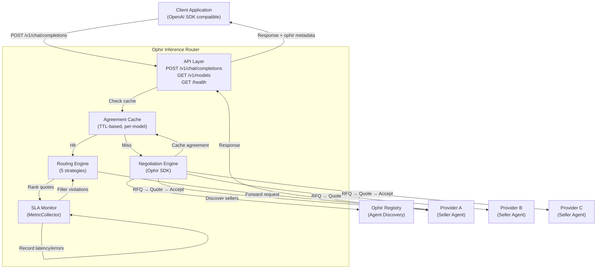
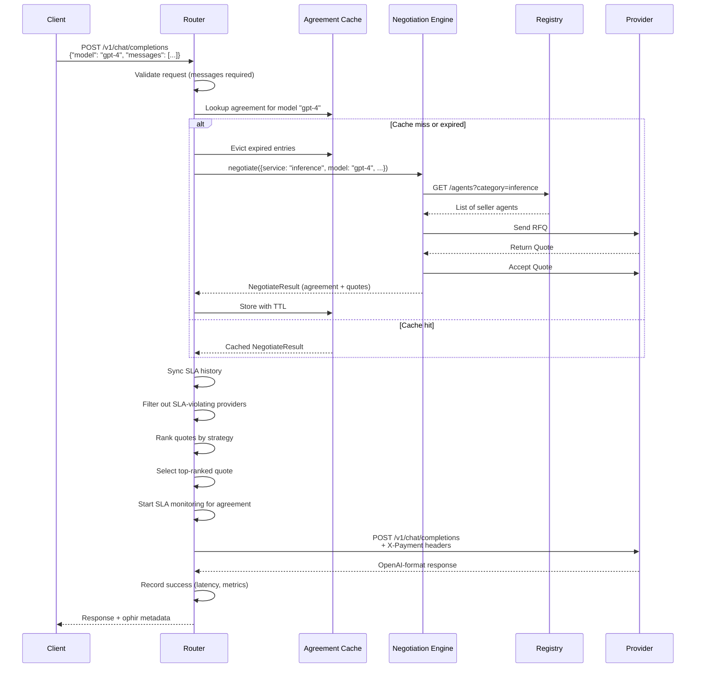

# Ophir Inference Router Protocol

**Version:** 1.0
**Status:** Draft
**Date:** 2026-03-05

## Abstract

The Ophir Inference Router Protocol defines an OpenAI-compatible HTTP gateway that automatically discovers, negotiates with, and routes inference requests to AI service providers through the Ophir Agent Negotiation Protocol. The router acts as a drop-in replacement for the OpenAI API, transparently handling provider discovery, price negotiation, agreement caching, SLA monitoring, and payment header attachment. Clients send standard `/v1/chat/completions` requests and receive standard OpenAI-shaped responses enriched with Ophir agreement metadata.

---

## Table of Contents

1. [Introduction](#1-introduction)
2. [Terminology](#2-terminology)
3. [Architecture](#3-architecture)
4. [API Specification](#4-api-specification)
5. [Routing Strategies](#5-routing-strategies)
6. [Agreement Caching](#6-agreement-caching)
7. [SLA Monitoring](#7-sla-monitoring)
8. [Provider Forwarding](#8-provider-forwarding)
9. [Configuration](#9-configuration)
10. [Error Handling](#10-error-handling)
11. [Security Considerations](#11-security-considerations)
12. [Deployment](#12-deployment)
13. [Backwards Compatibility](#13-backwards-compatibility)

---

## 1. Introduction

AI applications typically integrate with a single inference provider through the OpenAI-compatible API. This creates vendor lock-in, eliminates price competition, and provides no mechanism for SLA enforcement. The Ophir Inference Router solves these problems by sitting between the client and one or more providers, performing negotiation and routing transparently.

A router is an HTTP service that:

- Exposes the OpenAI-compatible `/v1/chat/completions` and `/v1/models` endpoints
- Discovers available providers through Ophir registries or direct seller lists
- Negotiates agreements using the Ophir Agent Negotiation Protocol
- Caches agreements with configurable TTL to avoid re-negotiation on every request
- Routes requests to the best provider according to a configurable strategy
- Monitors SLA compliance in real time and excludes violating providers
- Attaches X-Payment headers to forwarded requests for payment enforcement

The router is not a proxy — it is an active participant in the Ophir protocol. It holds a `did:key` identity, signs negotiation messages, and MAY fund Solana escrow accounts.

---

## 2. Terminology

The key words "MUST", "MUST NOT", "REQUIRED", "SHALL", "SHALL NOT", "SHOULD", "SHOULD NOT", "RECOMMENDED", "MAY", and "OPTIONAL" in this document are to be interpreted as described in [RFC 2119](https://www.ietf.org/rfc/rfc2119.txt).

**Router**
An HTTP service implementing this specification that accepts OpenAI-compatible requests and forwards them to negotiated Ophir providers.

**Provider**
An Ophir seller agent that exposes an `/v1/chat/completions` endpoint and participates in the Ophir negotiation protocol.

**Agreement**
A finalized negotiation outcome containing pricing terms, SLA commitments, and optionally an escrow reference. Agreements are identified by `agreement_id` and authenticated by `agreement_hash`.

**Routing Strategy**
An algorithm that ranks available provider quotes and selects the best one for a given request.

**Strategy Context**
Mutable state maintained across requests, including latency history, SLA compliance history, round-robin index, and weight configuration.

**SLA Violation**
A detected breach of a negotiated SLA metric, recorded with evidence and used to exclude the violating provider from future routing.

**X-Payment Headers**
HTTP headers attached to forwarded requests that communicate payment terms, agreement identity, and escrow details to the provider.

---

## 3. Architecture

The router comprises four primary components:

1. **API Layer** — Express HTTP server exposing OpenAI-compatible endpoints
2. **Negotiation Engine** — Ophir SDK `negotiate()` integration with agreement caching
3. **Routing Engine** — Strategy-based quote ranking and provider selection
4. **SLA Monitor** — Per-agreement metric collection, violation detection, and compliance scoring

### 3.1 Architecture Diagram



### 3.2 Request Lifecycle

The following sequence diagram illustrates the complete lifecycle of a routed request:



---

## 4. API Specification

The router MUST expose three HTTP endpoints. All endpoints accept and return `application/json`.

### 4.1 POST /v1/chat/completions

Routes an inference request to a negotiated provider.

**Request:**

```
POST /v1/chat/completions
Content-Type: application/json
```

```json
{
  "model": "gpt-4",
  "messages": [
    { "role": "system", "content": "You are a helpful assistant." },
    { "role": "user", "content": "Hello, world!" }
  ],
  "temperature": 0.7,
  "max_tokens": 1000,
  "stream": false
}
```

**Request fields:**

| Field | Type | Required | Description |
|---|---|---|---|
| `messages` | array | REQUIRED | Array of message objects with `role` and `content` |
| `model` | string | OPTIONAL | Model identifier. Defaults to `"auto"` |
| `temperature` | number | OPTIONAL | Sampling temperature (0–2) |
| `max_tokens` | number | OPTIONAL | Maximum tokens to generate |
| `stream` | boolean | OPTIONAL | Enable streaming. Defaults to `false` |

The `messages` field MUST be present and MUST be a non-empty array. Each message object MUST contain a `role` string (`"system"`, `"user"`, or `"assistant"`) and a `content` string.

When `model` is `"auto"` or omitted, the router negotiates with all known providers regardless of model and selects the best available.

**Response (200 OK):**

```json
{
  "id": "chatcmpl-abc123",
  "object": "chat.completion",
  "created": 1709654400,
  "model": "gpt-4",
  "choices": [
    {
      "index": 0,
      "message": {
        "role": "assistant",
        "content": "Hello! How can I help you today?"
      },
      "finish_reason": "stop"
    }
  ],
  "usage": {
    "prompt_tokens": 20,
    "completion_tokens": 9,
    "total_tokens": 29
  },
  "ophir": {
    "agreement_id": "neg_7f3a2b1c",
    "provider": "did:key:z6MkhaXgBZDvotDkL5257faiztiGiC2QtKLGpbnnEGta2doK",
    "negotiated_price": "0.005",
    "strategy": "cheapest",
    "latency_ms": 342
  }
}
```

**Response fields:**

The response body follows the [OpenAI Chat Completions](https://platform.openai.com/docs/api-reference/chat) format with one extension:

| Field | Type | Description |
|---|---|---|
| `id` | string | Unique completion identifier |
| `object` | string | Always `"chat.completion"` |
| `created` | number | Unix timestamp of creation |
| `model` | string | Model that generated the response |
| `choices` | array | Array of completion choices |
| `choices[].index` | number | Choice index |
| `choices[].message` | object | Generated message with `role` and `content` |
| `choices[].finish_reason` | string | `"stop"`, `"length"`, or `"content_filter"` |
| `usage` | object | Token usage statistics (if provided by upstream) |
| `ophir` | object | **Ophir extension.** Routing and agreement metadata |
| `ophir.agreement_id` | string | The negotiated agreement identifier |
| `ophir.provider` | string | The selected provider's `agent_id` or endpoint |
| `ophir.negotiated_price` | string | Price per unit from the agreement (decimal string) |
| `ophir.strategy` | string | Name of the routing strategy used |
| `ophir.latency_ms` | number | Total request latency in milliseconds |

The `ophir` extension is added by the router and MUST NOT be forwarded to the upstream provider.

**Error Responses:**

| Status | Type | Condition |
|---|---|---|
| `400` | `invalid_request_error` | `messages` is missing or not an array |
| `502` | `router_error` | Provider returned an error or is unreachable |
| `503` | `router_error` | No providers available for the requested model |

Error response format:

```json
{
  "error": {
    "message": "messages is required and must be an array",
    "type": "invalid_request_error"
  }
}
```

### 4.2 GET /v1/models

Lists available models from actively monitored agreements.

**Response (200 OK):**

```json
{
  "object": "list",
  "data": [
    { "id": "auto", "object": "model", "owned_by": "ophir" },
    { "id": "did:key:z6MkhaXgBZDvotDkL5257faiztiGiC2QtKLGpbnnEGta2doK", "object": "model", "owned_by": "ophir" },
    { "id": "did:key:z6Mkother...", "object": "model", "owned_by": "ophir" }
  ]
}
```

The response MUST always include the `auto` model entry. Additional entries represent seller identities from actively monitored agreements. Duplicate sellers MUST be deduplicated. The `owned_by` field MUST be `"ophir"`.

### 4.3 GET /health

Returns router health status and SLA compliance dashboard.

**Response (200 OK):**

```json
{
  "status": "ok",
  "timestamp": "2026-03-05T14:30:00.000Z",
  "agreements": {
    "active": 3,
    "with_violations": 1,
    "details": {
      "neg_7f3a2b1c": {
        "requestCount": 1542,
        "avgLatencyMs": 287.4,
        "errorRate": 0.003,
        "violations": [],
        "successCount": 1537,
        "lastErrors": [],
        "slaCompliance": 0.997
      },
      "neg_e4d2f1a8": {
        "requestCount": 893,
        "avgLatencyMs": 512.1,
        "errorRate": 0.021,
        "violations": [
          {
            "violation_id": "viol_a1b2c3",
            "metric": "p99_latency_ms",
            "threshold": 500,
            "observed": 842,
            "timestamp": "2026-03-05T14:15:00.000Z"
          }
        ],
        "successCount": 874,
        "lastErrors": ["HTTP 503: Service Temporarily Unavailable"],
        "slaCompliance": 0.879
      }
    }
  }
}
```

**Response fields:**

| Field | Type | Description |
|---|---|---|
| `status` | string | Always `"ok"` |
| `timestamp` | string | ISO 8601 datetime |
| `agreements.active` | number | Count of monitored agreements |
| `agreements.with_violations` | number | Count of agreements with active violations |
| `agreements.details` | object | Per-agreement statistics, keyed by `agreement_id` |

**Per-agreement detail fields:**

| Field | Type | Description |
|---|---|---|
| `requestCount` | number | Total requests routed through this agreement |
| `avgLatencyMs` | number | Average latency of successful requests |
| `errorRate` | number | Ratio of failed requests to total requests |
| `violations` | array | Active SLA violations (see [Section 7](#7-sla-monitoring)) |
| `successCount` | number | Count of successful requests |
| `lastErrors` | array | Ring buffer of last 10 error messages |
| `slaCompliance` | number | Compliance score from 0 to 1 (see [Section 7.5](#75-compliance-score)) |

---

## 5. Routing Strategies

The router supports five routing strategies. The active strategy is set at router creation time via configuration and applies to all requests.

All strategies receive a list of `QuoteParams` from the negotiation result and return a ranked list of `ProviderScore` objects:

```json
{
  "quote": { "...QuoteParams..." },
  "score": 1.0,
  "reason": "lowest price: 0.002 USDC/request"
}
```

The router MUST select the first (highest-scored) quote from the ranked list. If SLA-violating providers have been filtered out and no quotes remain, the router MUST fall back to the unfiltered list.

### 5.1 Cheapest

**Identifier:** `cheapest`
**Default:** Yes

Ranks providers by ascending `pricing.price_per_unit`. The cheapest provider is selected.

**Score formula:**

```
score = 1 / (1 + rank_index)
```

Where `rank_index` is the zero-based position after sorting by price ascending.

**Example:**

| Provider | Price (USDC) | Rank | Score |
|---|---|---|---|
| Provider C | 0.002 | 0 | 1.000 |
| Provider A | 0.005 | 1 | 0.500 |
| Provider B | 0.010 | 2 | 0.333 |

### 5.2 Fastest

**Identifier:** `fastest`

Ranks providers by ascending historical latency from the strategy context's `latencyHistory` map. Providers without latency history receive the median of all known latencies as a default estimate.

**Score formula:**

```
score = 1 / (1 + rank_index)
```

**Reason format:**

- Known latency: `"latency 142ms"`
- Estimated latency: `"latency ~287ms"` (tilde prefix indicates no direct measurement)

### 5.3 Best SLA

**Identifier:** `best_sla`

Ranks providers by descending SLA compliance score.

**Score source (in priority order):**

1. Historical compliance from `strategyContext.slaHistory` map (if available)
2. Computed from `sla_offered.metrics`: average of normalized target values (targets > 1 are divided by 100)
3. Default: `0.5` for completely unknown providers

**Reason format:** `"sla compliance: 0.95"`

### 5.4 Round Robin

**Identifier:** `round_robin`

Cycles through available providers in a deterministic rotation. The router maintains a `roundRobinIndex` counter in the strategy context that increments after each route.

**Selection algorithm:**

```
idx = roundRobinIndex % quotes.length
selected = quotes[idx]
roundRobinIndex++
```

**Score formula:**

```
selected quote:  score = 1.0
all others:      score = 1 / (1 + offset_from_selected)
```

### 5.5 Weighted

**Identifier:** `weighted`

Combines price, latency, and SLA into a composite score using configurable weights.

**Default weights:**

| Component | Weight | Default |
|---|---|---|
| `price` | Inverse of `price_per_unit` | 0.4 |
| `latency` | Inverse of historical latency (ms) | 0.3 |
| `sla` | Historical compliance (0–1) | 0.3 |

**Composite formula:**

```
priceComponent  = 1 / price_per_unit
latencyComponent = 1 / latency_ms
slaComponent    = slaHistory[provider] (0–1)

composite = (weight.price × priceComponent)
          + (weight.latency × latencyComponent)
          + (weight.sla × slaComponent)
```

**Reason format:** `"weighted(p=200.0, l=0.007, s=0.95) = 80.302"`

Weights MAY be overridden via the `weights` field in `strategyContext`.

---

## 6. Agreement Caching

The router caches negotiation results to avoid re-negotiating on every request. Caching is per-model and TTL-based.

### 6.1 Cache Key

```
cacheKey = model === "auto" ? "__auto__" : model
```

Each unique model string maps to a separate cache entry. The special model `"auto"` uses the key `"__auto__"`.

### 6.2 Cache Entry

```json
{
  "result": { "...NegotiateResult..." },
  "expiresAt": 1709655000000,
  "sla": { "...SLARequirement..." }
}
```

| Field | Type | Description |
|---|---|---|
| `result` | NegotiateResult | Full negotiation result including agreement and quotes |
| `expiresAt` | number | Expiration time in milliseconds since epoch |
| `sla` | SLARequirement | Effective SLA for this agreement (OPTIONAL) |

### 6.3 TTL Configuration

The cache TTL is configured via the `agreementCacheTtl` parameter in seconds. The default is **300 seconds** (5 minutes).

```
expiresAt = Date.now() + (agreementCacheTtl × 1000)
```

### 6.4 Cache Lifecycle

**Lookup:** On every `route()` call, the router checks for a cached entry matching the model key. If the entry exists and `Date.now() < expiresAt`, the cached `NegotiateResult` is used.

**Store:** After a successful negotiation, the result is stored with a computed `expiresAt`.

**Eviction:** On every `route()` call, before lookup, the router MUST iterate all cache entries and delete any where `Date.now() > expiresAt` (lazy eviction).

**Manual invalidation:** The router MUST support explicit cache invalidation:

- `invalidateCache()` — Clears all cached entries
- `invalidateCache(model)` — Clears the entry for a specific model

### 6.5 Cache Reuse Conditions

A cached agreement is reused when:
1. The cache entry has not expired
2. The model cache key matches
3. The agreement is still valid (not disputed or completed)

---

## 7. SLA Monitoring

The router monitors SLA compliance for every active agreement by recording per-request metrics and evaluating them against the negotiated SLA specification.

### 7.1 Monitored Agreement State

For each active agreement, the monitor maintains:

| Field | Type | Description |
|---|---|---|
| `agreementId` | string | The agreement identifier |
| `sellerId` | string | The provider's `agent_id` |
| `collector` | MetricCollector | Records individual metric samples |
| `violations` | array | Accumulated SLA violations |
| `requestCount` | number | Total requests through this agreement |
| `totalLatencyMs` | number | Sum of latencies for successful requests |
| `errorCount` | number | Count of failed requests |
| `lastErrors` | string[] | Ring buffer of last 10 error messages |
| `slaSpec` | object | Lockstep verification spec for evaluation |

### 7.2 Metric Recording

**On success:** The monitor records the following metrics per successful request:

| Metric | Value | Description |
|---|---|---|
| `p99_latency_ms` | `latencyMs` | End-to-end request latency |
| `p50_latency_ms` | `latencyMs` | End-to-end request latency |
| `time_to_first_byte_ms` | `latencyMs` | Time to first byte (approximated) |
| `uptime_pct` | `100` | Provider was available |
| `error_rate_pct` | `0` | No error occurred |

**On failure:** The monitor records:

| Metric | Value | Description |
|---|---|---|
| `uptime_pct` | `0` | Provider was unavailable |
| `error_rate_pct` | `100` | Error occurred |

The error message is appended to the `lastErrors` ring buffer (maximum 10 entries, FIFO).

### 7.3 Violation Detection

After each metric recording (success or failure), the monitor evaluates violations against the agreement's SLA specification.

**Evaluation pipeline:**

1. The `MetricCollector` aggregates samples over the configured `measurement_window`
2. A minimum of **10 samples** is required before evaluation
3. Each behavioral check compares the aggregate against the threshold using the specified `operator` (`lte`, `gte`, `eq`)
4. Consecutive failures are tracked per metric
5. When `consecutive_failures >= 3` (default threshold):
   a. A cooldown period of **300 seconds** is checked to prevent duplicate violations
   b. If cooldown has elapsed, a `Violation` record is created

**Violation record:**

```json
{
  "violation_id": "viol_a1b2c3d4",
  "agreement_id": "neg_7f3a2b1c",
  "agreement_hash": "sha256:abc123...",
  "metric": "p99_latency_ms",
  "threshold": 500,
  "observed": 842,
  "operator": "lte",
  "measurement_window": "PT1H",
  "sample_count": 156,
  "timestamp": "2026-03-05T14:15:00.000Z",
  "consecutive_count": 3,
  "samples": [ { "value": 842, "timestamp": "..." }, "..." ],
  "evidence_hash": "sha256:def456..."
}
```

### 7.4 Violation-Based Filtering

Before ranking quotes, the router MUST check for active violations:

1. Collect all seller IDs with active violations
2. Remove their quotes from the candidate list
3. If all quotes are removed, fall back to the unfiltered list (degraded mode)

This ensures that violating providers are immediately excluded from routing without requiring manual intervention.

### 7.5 Compliance Score

The SLA compliance score is computed as:

```
compliance = max(0, 1 - errorRate - violationPenalty)
```

Where:
- `errorRate = errorCount / requestCount`
- `violationPenalty = min(violations.length × 0.1, 0.5)`

| Score | Meaning |
|---|---|
| 1.0 | Perfect — no errors, no violations |
| 0.9 | Good — low error rate, one violation |
| 0.5 | Degraded — high error rate or 5+ violations |
| 0.0 | Failed — complete outage or extreme violation count |

Compliance scores are synchronized into the strategy context's `slaHistory` map on every `route()` call, making them available to the `best_sla` and `weighted` strategies.

---

## 8. Provider Forwarding

When a provider is selected, the router forwards the original request to the provider's inference endpoint.

### 8.1 Target URL

```
POST https://{provider_endpoint}/v1/chat/completions
```

The `provider_endpoint` is extracted from the selected quote's `seller.endpoint` field.

### 8.2 Request Headers

The router MUST set `Content-Type: application/json`. If a valid agreement exists, the router MUST attach X-Payment headers.

### 8.3 X-Payment Headers

X-Payment headers communicate payment terms to the provider. They are derived from the agreement's `final_terms`:

| Header | Source | Condition |
|---|---|---|
| `X-Payment-Amount` | `final_terms.price_per_unit` | Always (if agreement exists) |
| `X-Payment-Currency` | `final_terms.currency` | Always (if agreement exists) |
| `X-Payment-Agreement-Id` | `agreement.agreement_id` | Always (if agreement exists) |
| `X-Payment-Agreement-Hash` | `agreement.agreement_hash` | Always (if agreement exists) |
| `X-Payment-Unit` | `final_terms.unit` | Always (if agreement exists) |
| `X-Payment-Network` | `final_terms.escrow.network` | If escrow is configured |
| `X-Payment-Escrow-Deposit` | `final_terms.escrow.deposit_amount` | If escrow is configured |
| `X-Payment-Escrow-Address` | `agreement.escrow.address` | If escrow is funded |

**Example forwarded request:**

```
POST https://provider.example.com/v1/chat/completions
Content-Type: application/json
X-Payment-Amount: 0.005
X-Payment-Currency: USDC
X-Payment-Agreement-Id: neg_7f3a2b1c
X-Payment-Agreement-Hash: sha256:abc123...
X-Payment-Unit: request
X-Payment-Network: solana
X-Payment-Escrow-Deposit: 1.00
X-Payment-Escrow-Address: 7nYB...PDA
```

```json
{
  "model": "gpt-4",
  "messages": [
    { "role": "user", "content": "Hello, world!" }
  ],
  "temperature": 0.7,
  "max_tokens": 1000,
  "stream": false
}
```

If X-Payment header construction fails (e.g., missing agreement fields), the router SHOULD continue without payment headers. This is a non-fatal error.

### 8.4 Response Handling

**On success (HTTP 2xx):**

1. Parse response as JSON
2. Record success metrics (latency)
3. Update latency history for the provider
4. Return the response to the client with `ophir` metadata appended

**On failure (HTTP 4xx/5xx):**

1. Record failure with error message `"HTTP {status}: {body}"`
2. Update latency history for the provider
3. Return `502 Bad Gateway` to the client

**On network error:**

1. Record failure with the error message
2. Return `502 Bad Gateway` to the client

---

## 9. Configuration

### 9.1 Environment Variables

| Variable | Type | Default | Description |
|---|---|---|---|
| `PORT` | number | `8421` | HTTP server listening port |
| `OPHIR_STRATEGY` | string | `cheapest` | Default routing strategy |
| `OPHIR_REGISTRY_URL` | string | — | Registry endpoint for provider discovery |
| `OPHIR_MAX_BUDGET` | string | `1.00` | Maximum price per unit in USDC |
| `OPHIR_SELLERS` | string | — | Comma-separated list of direct seller endpoint URLs |

`OPHIR_SELLERS` is parsed by splitting on commas, trimming whitespace, and filtering empty strings:

```
OPHIR_SELLERS=https://seller1.example.com,https://seller2.example.com
```

### 9.2 Programmatic Configuration

The `RouterConfig` object provides full programmatic control:

```json
{
  "strategy": "weighted",
  "registries": ["https://registry.ophir.ai/v1"],
  "sellers": ["https://seller1.example.com", "https://seller2.example.com"],
  "agreementCacheTtl": 600,
  "maxBudget": "0.50",
  "currency": "USDC",
  "sla": {
    "metrics": [
      { "name": "p99_latency_ms", "target": 500, "comparison": "lte" },
      { "name": "uptime_pct", "target": 99.9, "comparison": "gte" },
      { "name": "error_rate_pct", "target": 1.0, "comparison": "lte" }
    ],
    "dispute_resolution": {
      "method": "automatic_escrow"
    }
  },
  "maxRetries": 1
}
```

**Configuration fields:**

| Field | Type | Default | Description |
|---|---|---|---|
| `strategy` | string | `"cheapest"` | Routing strategy (see [Section 5](#5-routing-strategies)) |
| `registries` | string[] | `[]` | Ophir registry endpoints for discovery |
| `sellers` | string[] | `[]` | Direct seller endpoints (bypass registry) |
| `agreementCacheTtl` | number | `300` | Agreement cache TTL in seconds |
| `maxBudget` | string | `"1.00"` | Maximum price per unit (decimal string) |
| `currency` | string | `"USDC"` | Payment currency |
| `sla` | object | — | SLA requirements for negotiation |
| `maxRetries` | number | `1` | Maximum retry attempts per request |

At least one of `registries` or `sellers` MUST be configured. If both are provided, the router discovers from registries AND contacts direct sellers, merging the results.

### 9.3 SLA Configuration

The `sla` object specifies SLA requirements that the router communicates during negotiation:

```json
{
  "metrics": [
    {
      "name": "p99_latency_ms",
      "target": 500,
      "comparison": "lte",
      "measurement_method": "percentile",
      "measurement_window": "PT1H",
      "penalty_per_violation": {
        "amount": "0.10",
        "currency": "USDC",
        "max_penalties_per_window": 3
      }
    }
  ],
  "dispute_resolution": {
    "method": "lockstep_verification",
    "timeout_hours": 24
  }
}
```

**Supported SLA metric names:**

| Name | Unit | Description |
|---|---|---|
| `uptime_pct` | % | Availability percentage |
| `p50_latency_ms` | ms | 50th percentile latency |
| `p99_latency_ms` | ms | 99th percentile latency |
| `accuracy_pct` | % | Response accuracy |
| `throughput_rpm` | req/min | Sustained throughput |
| `error_rate_pct` | % | Error rate |
| `time_to_first_byte_ms` | ms | Time to first byte |
| `custom` | varies | Custom metric (requires `custom_name`) |

**Comparison operators:**

| Operator | Meaning |
|---|---|
| `gte` | Metric MUST be greater than or equal to target |
| `lte` | Metric MUST be less than or equal to target |
| `eq` | Metric MUST equal target |
| `between` | Metric MUST fall within a range |

**Dispute resolution methods:**

| Method | Description |
|---|---|
| `automatic_escrow` | Automated escrow release/clawback based on SLA metrics |
| `lockstep_verification` | Cryptographic verification via the Lockstep protocol |
| `timeout_release` | Escrow released after timeout if no dispute |
| `manual_arbitration` | Human arbitrator resolves disputes |

---

## 10. Error Handling

### 10.1 Error Response Format

All router errors use the OpenAI-compatible error format:

```json
{
  "error": {
    "message": "Human-readable error description",
    "type": "error_type"
  }
}
```

### 10.2 Error Types

| Type | HTTP Status | Description |
|---|---|---|
| `invalid_request_error` | 400 | Malformed request (missing messages, invalid format) |
| `router_error` | 502 | Provider returned an error or is unreachable |
| `router_error` | 503 | No providers available for the requested model |

### 10.3 Provider Error Classification

The router classifies provider errors by inspecting the error message:

| Error Message Pattern | HTTP Status | Interpretation |
|---|---|---|
| Contains `"No providers available"` | 503 | No sellers responded or all were filtered |
| Contains `"Provider returned"` | 502 | Provider returned a non-2xx status |
| All other errors | 502 | Network error, timeout, or unexpected failure |

### 10.4 Fallback Behavior

When SLA violations exclude all providers:

1. The router detects that the filtered quote list is empty
2. The router falls back to the **unfiltered** quote list
3. The request is routed to the highest-ranked provider from the full list
4. This prevents total service outage when all providers have violations

### 10.5 Ophir Protocol Error Codes

The following error codes from the Ophir protocol MAY surface during negotiation:

| Code | Name | Description |
|---|---|---|
| `OPHIR_001` | `INVALID_MESSAGE` | JSON schema validation failure |
| `OPHIR_002` | `INVALID_SIGNATURE` | Ed25519 signature verification failed |
| `OPHIR_003` | `EXPIRED_MESSAGE` | Message past `expires_at` timestamp |
| `OPHIR_004` | `INVALID_STATE_TRANSITION` | Invalid negotiation state transition |
| `OPHIR_005` | `MAX_ROUNDS_EXCEEDED` | Max negotiation rounds reached |
| `OPHIR_006` | `DUPLICATE_MESSAGE` | Replay detected (message ID reused) |
| `OPHIR_100` | `NO_MATCHING_SELLERS` | No sellers match service requirements |
| `OPHIR_101` | `BUDGET_EXCEEDED` | Quote price exceeds budget |
| `OPHIR_102` | `SLA_REQUIREMENTS_NOT_MET` | Provider SLA offer insufficient |
| `OPHIR_103` | `QUOTE_EXPIRED` | Quote past expiration |
| `OPHIR_104` | `NEGOTIATION_TIMEOUT` | Negotiation timed out |
| `OPHIR_400` | `SELLER_UNREACHABLE` | Network error contacting seller |

When a negotiation-level error occurs, the router MUST return `503 Service Unavailable` with a descriptive message.

---

## 11. Security Considerations

### 11.1 Transport Security

All communication between the router and providers MUST use HTTPS (TLS 1.2 or later) in production deployments. Communication between the client and the router SHOULD use HTTPS.

### 11.2 API Key Passthrough

The router does NOT implement its own authentication layer. Deployments that require access control SHOULD place the router behind a reverse proxy (e.g., nginx, Caddy) that handles API key validation.

The router MUST NOT forward client authentication headers (e.g., `Authorization`) to upstream providers. Provider authentication is handled by the Ophir negotiation protocol via Ed25519 signatures.

### 11.3 Provider Credential Management

The router holds an Ed25519 keypair for Ophir protocol participation. This keypair:

- MUST be generated with a cryptographically secure random number generator
- MUST be stored securely (e.g., environment variable, secrets manager)
- MUST NOT be logged or exposed through any API endpoint
- SHOULD be rotated periodically

### 11.4 X-Payment Header Integrity

X-Payment headers are derived from the signed agreement. Providers SHOULD verify that the `X-Payment-Agreement-Hash` matches their local copy of the agreement before accepting requests. This prevents header tampering.

### 11.5 SLA Evidence Integrity

Violation evidence includes an `evidence_hash` computed over the metric samples. This hash provides tamper-evident records that can be submitted to the Lockstep verification protocol or a dispute arbitrator.

### 11.6 Denial of Service

The router's SLA monitoring and agreement caching consume memory proportional to the number of active agreements and recorded samples. Implementations SHOULD:

- Limit the maximum number of concurrent monitored agreements
- Configure `MetricCollector` retention to bound sample storage (default: 168 hours)
- Implement request rate limiting at the API layer

### 11.7 Provider Trust

The router trusts provider responses at the HTTP level — it does not independently verify inference output correctness. For applications requiring output verification, the `accuracy_pct` SLA metric combined with the Lockstep verification protocol provides a mechanism for detecting and disputing incorrect outputs.

---

## 12. Deployment

### 12.1 Standalone Server

The router ships as a standalone Node.js application:

```bash
PORT=8421 \
OPHIR_STRATEGY=weighted \
OPHIR_REGISTRY_URL=https://registry.ophir.ai/v1 \
OPHIR_MAX_BUDGET=0.50 \
npx @ophirai/router
```

Default port: **8421**.

### 12.2 Docker

```dockerfile
FROM node:20-slim
WORKDIR /app
RUN npm install @ophirai/router
ENV PORT=8421
ENV OPHIR_STRATEGY=cheapest
EXPOSE 8421
CMD ["npx", "@ophirai/router"]
```

### 12.3 Embedded in Application

The router can be embedded directly in a Node.js application:

```typescript
import { createRouterServer } from '@ophirai/router';

const { start, router } = createRouterServer({
  port: 8421,
  strategy: 'best_sla',
  registries: ['https://registry.ophir.ai/v1'],
  agreementCacheTtl: 600,
  maxBudget: '0.50',
  sla: {
    metrics: [
      { name: 'p99_latency_ms', target: 500, comparison: 'lte' },
      { name: 'uptime_pct', target: 99.9, comparison: 'gte' }
    ],
    dispute_resolution: { method: 'automatic_escrow' }
  }
});

await start();
// Router is now listening on port 8421

// Programmatic routing (bypass HTTP):
const result = await router.route({
  model: 'gpt-4',
  messages: [{ role: 'user', content: 'Hello' }]
});

// Manual cache invalidation:
router.invalidateCache();
router.invalidateCache('gpt-4');
```

### 12.4 Integration with OpenAI SDKs

Because the router implements the OpenAI-compatible API, any OpenAI SDK can be pointed at it:

```typescript
import OpenAI from 'openai';

const client = new OpenAI({
  baseURL: 'http://localhost:8421/v1',
  apiKey: 'unused' // Router does not require API keys
});

const completion = await client.chat.completions.create({
  model: 'auto',
  messages: [{ role: 'user', content: 'Hello, world!' }]
});

// completion.ophir contains routing metadata
```

```python
from openai import OpenAI

client = OpenAI(
    base_url="http://localhost:8421/v1",
    api_key="unused"
)

completion = client.chat.completions.create(
    model="auto",
    messages=[{"role": "user", "content": "Hello, world!"}]
)
```

---

## 13. Backwards Compatibility

### 13.1 Versioning

The router API follows the OpenAI API convention with a `/v1/` path prefix. Future breaking changes MUST be introduced under a new version prefix (e.g., `/v2/`).

### 13.2 Ophir Extension Stability

The `ophir` extension object in chat completion responses is additive. New fields MAY be added to the `ophir` object in future versions. Clients MUST NOT fail on unrecognized fields in the `ophir` object.

### 13.3 Strategy Extensibility

New routing strategies MAY be added in future versions. Unknown strategy names MUST cause the router to return a clear error at startup, not silently fall back to a default.

### 13.4 X-Payment Header Evolution

New `X-Payment-*` headers MAY be added in future versions. Providers MUST ignore unrecognized X-Payment headers. The existing headers defined in [Section 8.3](#83-x-payment-headers) MUST NOT change semantics.

### 13.5 Configuration Compatibility

New configuration fields MAY be added as OPTIONAL with sensible defaults. Existing configuration fields MUST NOT change type or default value within a major version.
