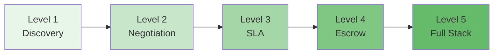

# Ophir-Ready Certification

**Version:** 1.0
**Status:** Draft
**Date:** 2026-03-05

## Abstract

The Ophir-Ready Certification defines a tiered compliance standard for implementations of the Ophir Agent Negotiation Protocol. It provides a structured way for providers, agents, and platforms to declare and verify their level of protocol support — from basic discovery through full-stack integration with escrow-backed payments. The certification enables buyers to assess interoperability at a glance and provides implementors with a clear roadmap toward complete protocol adoption.

This specification defines five certification levels, a self-assessment endpoint, compliance testing procedures, badge usage guidelines, and an automated verification framework.

---

## Table of Contents

1. [Introduction](#1-introduction)
2. [Terminology](#2-terminology)
3. [Certification Levels](#3-certification-levels)
4. [Self-Assessment Endpoint](#4-self-assessment-endpoint)
5. [Compliance Testing](#5-compliance-testing)
6. [Badge Usage](#6-badge-usage)
7. [Automated Verification](#7-automated-verification)
8. [Provider Directory](#8-provider-directory)
9. [Security Considerations](#9-security-considerations)
10. [Backwards Compatibility](#10-backwards-compatibility)

---

## 1. Introduction

The Ophir protocol encompasses discovery, negotiation, SLA monitoring, escrow payments, and registry integration. Not every implementation needs — or is ready to implement — all of these layers. The Ophir-Ready Certification provides a progressive adoption path with clearly defined milestones.

Each certification level builds on the previous one. An implementation that achieves Level 3 (SLA) is guaranteed to also satisfy Level 1 (Discovery) and Level 2 (Negotiation). This cumulative structure lets buyers reason about a provider's capabilities from a single integer.

Certification is self-assessed and optionally verified. Implementations declare their level via a well-known endpoint. An automated verification tool (`ophir verify`) validates these claims against the requirements defined in this specification.

---

## 2. Terminology

The key words "MUST", "MUST NOT", "REQUIRED", "SHALL", "SHALL NOT", "SHOULD", "SHOULD NOT", "RECOMMENDED", "MAY", and "OPTIONAL" in this document are to be interpreted as described in [RFC 2119](https://www.ietf.org/rfc/rfc2119.txt).

**Candidate**
An implementation (provider, agent, router, or platform) seeking Ophir-Ready certification.

**Certification Level**
An integer from 1 to 5 indicating the scope of Ophir protocol support.

**Self-Assessment**
A JSON document served by the candidate at `/.well-known/ophir-ready.json` declaring its certification level and capabilities.

**Verification**
The process of testing a candidate's claims against the requirements of its declared certification level.

**Verified**
A candidate whose self-assessed certification level has been confirmed by the automated verification tool or a manual audit.

---

## 3. Certification Levels

### 3.1 Level 1: Discovery

**Summary:** The candidate is discoverable as an Ophir-compatible agent.

**Requirements:**

1. The candidate MUST serve a valid A2A Agent Card at `GET /.well-known/agent.json` with `Content-Type: application/json`.
2. The Agent Card MUST include `capabilities.negotiation.supported` set to `true`.
3. The Agent Card MUST include a valid `capabilities.negotiation.endpoint` URL.
4. The Agent Card MUST include at least one entry in `capabilities.negotiation.protocols` containing `"ophir/1.0"`.
5. The Agent Card MUST include at least one service offering in `capabilities.negotiation.services` with `category`, `base_price`, `currency`, and `unit` fields.
6. The Agent Card MUST include at least one entry in `capabilities.negotiation.acceptedPayments`.
7. The candidate SHOULD serve `/.well-known/ophir.json` with Ophir-specific metadata.
8. The candidate SHOULD include `Access-Control-Allow-Origin: *` on well-known endpoint responses.

**Wire Format — Agent Card (minimum):**

```json
{
  "name": "Example Provider",
  "url": "https://provider.example.com",
  "capabilities": {
    "negotiation": {
      "supported": true,
      "endpoint": "https://provider.example.com/ophir/negotiate",
      "protocols": ["ophir/1.0"],
      "acceptedPayments": [
        { "network": "solana", "token": "USDC" }
      ],
      "services": [
        {
          "category": "inference",
          "description": "Chat completions",
          "base_price": "0.005",
          "currency": "USDC",
          "unit": "request"
        }
      ]
    }
  }
}
```

### 3.2 Level 2: Negotiation

**Summary:** The candidate supports the full negotiation lifecycle with cryptographic message signing.

**Requirements (in addition to Level 1):**

1. The candidate MUST accept JSON-RPC 2.0 messages at its declared negotiation endpoint via HTTP POST.
2. The candidate MUST support the following JSON-RPC methods:
   - `ophir.rfq` — Receive a Request for Quote
   - `ophir.quote` — Send a quote in response to an RFQ
   - `ophir.counter` — Send or receive counter-offers
   - `ophir.accept` — Accept terms and finalize an agreement
   - `ophir.reject` — Reject terms and terminate negotiation
3. The candidate MUST possess an Ed25519 keypair and identify itself with a `did:key` URI (multicodec `0xed01` + Ed25519 public key, base58-btc encoded).
4. All outgoing negotiation messages MUST be signed with the candidate's Ed25519 private key. The signature MUST cover the JCS (JSON Canonicalization Scheme) representation of the message payload.
5. The candidate MUST verify Ed25519 signatures on all incoming negotiation messages. Messages with invalid signatures MUST be rejected with error code `OPHIR_002` (`INVALID_SIGNATURE`).
6. The candidate MUST implement the negotiation state machine with the following states: `IDLE`, `RFQ_SENT`, `QUOTES_RECEIVED`, `COUNTERING`, `ACCEPTED`, `ESCROWED`, `ACTIVE`, `COMPLETED`, `REJECTED`, `DISPUTED`, `RESOLVED`.
7. Invalid state transitions MUST be rejected with error code `OPHIR_004` (`INVALID_STATE_TRANSITION`).
8. The candidate MUST support message expiration. Messages past their `expires_at` timestamp MUST be rejected with error code `OPHIR_003` (`EXPIRED_MESSAGE`).
9. The candidate MUST implement replay protection. Duplicate message IDs within the replay protection window (default: 10 minutes) MUST be rejected with error code `OPHIR_006` (`DUPLICATE_MESSAGE`).
10. Upon successful acceptance, the candidate MUST produce an `Agreement` object containing `agreement_id`, `agreement_hash`, `final_terms`, `buyer`, `seller`, and timestamp fields. The `agreement_hash` MUST be the SHA-256 hash of the JCS-canonicalized final terms.

**Wire Format — RFQ (JSON-RPC 2.0):**

```json
{
  "jsonrpc": "2.0",
  "method": "ophir.rfq",
  "id": "req_1",
  "params": {
    "message_id": "msg_abc123",
    "sender": "did:key:z6MkbuyerKey...",
    "recipient": "did:key:z6MksellerKey...",
    "service": {
      "category": "inference",
      "requirements": { "model": "gpt-4" }
    },
    "budget": {
      "max_price": "0.01",
      "currency": "USDC",
      "unit": "request"
    },
    "sla": {
      "metrics": [
        { "name": "p99_latency_ms", "target": 500, "comparison": "lte" }
      ]
    },
    "expires_at": "2026-03-05T15:00:00.000Z",
    "signature": "<base64-encoded Ed25519 signature>"
  }
}
```

**Wire Format — Quote Response:**

```json
{
  "jsonrpc": "2.0",
  "method": "ophir.quote",
  "id": "req_2",
  "params": {
    "message_id": "msg_def456",
    "negotiation_id": "neg_7f3a2b1c",
    "sender": "did:key:z6MksellerKey...",
    "recipient": "did:key:z6MkbuyerKey...",
    "pricing": {
      "price_per_unit": "0.005",
      "currency": "USDC",
      "unit": "request"
    },
    "sla_offered": {
      "metrics": [
        { "name": "p99_latency_ms", "target": 500, "comparison": "lte" },
        { "name": "uptime_pct", "target": 99.9, "comparison": "gte" }
      ]
    },
    "expires_at": "2026-03-05T15:05:00.000Z",
    "signature": "<base64-encoded Ed25519 signature>"
  }
}
```

### 3.3 Level 3: SLA

**Summary:** The candidate reports SLA metrics and supports metric-based evaluation.

**Requirements (in addition to Level 2):**

1. The candidate MUST report all 8 standard SLA metrics defined in the Ophir protocol:

   | Metric | Unit | Description |
   |---|---|---|
   | `uptime_pct` | % | Service availability percentage |
   | `p50_latency_ms` | ms | 50th percentile request latency |
   | `p99_latency_ms` | ms | 99th percentile request latency |
   | `accuracy_pct` | % | Response accuracy percentage |
   | `throughput_rpm` | req/min | Sustained request throughput |
   | `error_rate_pct` | % | Request error rate |
   | `time_to_first_byte_ms` | ms | Time to first response byte |
   | `custom` | varies | Custom metric (requires `custom_name`) |

2. The candidate MUST accept SLA requirements in RFQ messages and reflect achievable targets in quote responses via the `sla_offered` field.
3. The candidate MUST support the `MetricCollector` evaluation model: recording per-request metric samples and computing aggregates over configurable measurement windows using the supported measurement methods (`rolling_average`, `percentile`, `absolute`, `sampled`).
4. The candidate MUST support behavioral checks with configurable violation policies including `consecutive_failures` thresholds and `cooldown_seconds` between violations.
5. The candidate MUST produce `Violation` records containing `violation_id`, `agreement_id`, `agreement_hash`, `metric`, `threshold`, `observed`, `operator`, `measurement_window`, `sample_count`, `timestamp`, `consecutive_count`, `samples`, and `evidence_hash`.
6. The `evidence_hash` in violation records MUST be a SHA-256 hash computed over the violation's metric samples, providing tamper-evident evidence.
7. The candidate MUST support at least one dispute resolution method: `automatic_escrow`, `lockstep_verification`, `timeout_release`, or `manual_arbitration`.
8. The candidate SHOULD support the Lockstep Verification Protocol for cryptographic SLA compliance proofs.

### 3.4 Level 4: Escrow

**Summary:** The candidate supports Solana PDA escrow for payment enforcement.

**Requirements (in addition to Level 3):**

1. The candidate MUST support Solana PDA-based escrow accounts for agreement payments.
2. The candidate MUST derive escrow PDA addresses deterministically using seeds `["escrow", buyer_pubkey, agreement_hash]` against the Ophir escrow program (`CHwqh23SpWSM6WLsd15iQcP4KSkB351S9eGcN4fQSVqy`).
3. The candidate MUST derive vault token account PDAs using seeds `["vault", escrow_pubkey]`.
4. The candidate MUST support the full escrow lifecycle:
   - `make_escrow` — Create escrow and deposit SPL tokens into the vault
   - `release_escrow` — Release funds to seller upon successful completion
   - `dispute_escrow` — File a dispute with evidence, splitting funds by penalty
   - `cancel_escrow` — Cancel and refund after timeout expiration
5. The `make_escrow` instruction MUST serialize in Borsh format: `discriminator(8) + agreement_hash(32) + deposit_amount(u64) + timeout_slots(u64) + penalty_rate_bps(u16)`.
6. The candidate MUST validate that `deposit_amount > 0` and `penalty_rate_bps <= 10000`.
7. The candidate MUST support `EscrowStatus` transitions: `Active → Released`, `Active → Disputed`, `Active → Cancelled`.
8. The candidate MUST deserialize on-chain `EscrowAccount` data (164 bytes) and verify the Anchor account discriminator.
9. The candidate MUST include escrow terms in agreement negotiation via the `escrow` field in `final_terms`:

   ```json
   {
     "final_terms": {
       "price_per_unit": "0.005",
       "currency": "USDC",
       "unit": "request",
       "escrow": {
         "network": "solana",
         "deposit_amount": "1.00",
         "timeout_slots": 216000,
         "penalty_rate_bps": 500
       }
     }
   }
   ```

10. The candidate MUST attach X-Payment headers to forwarded requests when an escrow is active:

    | Header | Description |
    |---|---|
    | `X-Payment-Amount` | Price per unit from final terms |
    | `X-Payment-Currency` | Payment currency |
    | `X-Payment-Agreement-Id` | Agreement identifier |
    | `X-Payment-Agreement-Hash` | SHA-256 hash of canonicalized terms |
    | `X-Payment-Network` | Blockchain network (e.g., `solana`) |
    | `X-Payment-Escrow-Deposit` | Deposit amount |
    | `X-Payment-Escrow-Address` | Base58-encoded escrow PDA address |

### 3.5 Level 5: Full Stack

**Summary:** The candidate implements the complete Ophir protocol stack including registry integration and automated liveness.

**Requirements (in addition to Level 4):**

1. The candidate MUST register with at least one Ophir registry using the Ed25519 challenge-response authentication flow:
   a. Request a challenge via `POST /auth/challenge` with the agent's `did:key`.
   b. Sign the challenge with the agent's Ed25519 private key.
   c. Submit the registration via `POST /agents` with `X-Agent-Id` and `X-Agent-Signature` headers.
2. The candidate MUST send periodic heartbeats via `POST /agents/:agentId/heartbeat` at an interval no greater than 15 minutes (half the default 30-minute staleness threshold).
3. Heartbeats MUST be authenticated using the same Ed25519 challenge-response mechanism as registration.
4. The candidate MUST support deregistration via `DELETE /agents/:agentId` when shutting down gracefully.
5. The candidate MUST serve `/.well-known/ophir-ready.json` (Section 4) with `level` set to `5`.
6. The candidate SHOULD support the reputation reporting endpoint (`POST /reputation/:agentId`) as a counterparty reporter.
7. The candidate SHOULD support the inference router's auto-discovery flow: being discoverable via registry queries filtered by `category`, `max_price`, `currency`, and `min_reputation`.

### 3.6 Level Summary



| Level | Name | Key Capability | Minimum Endpoints |
|---|---|---|---|
| 1 | Discovery | `/.well-known/agent.json` | 1 |
| 2 | Negotiation | RFQ/Quote/Counter/Accept/Reject + Ed25519 | 2 |
| 3 | SLA | 8 SLA metrics + MetricCollector + violations | 2 |
| 4 | Escrow | Solana PDA escrow lifecycle | 2 + Solana |
| 5 | Full Stack | Registry + heartbeat + auto-discovery | 2 + Solana + registry |

---

## 4. Self-Assessment Endpoint

Every Ophir-Ready candidate MUST serve a self-assessment document at:

```
GET /.well-known/ophir-ready.json
```

### 4.1 Schema

```json
{
  "ophir_ready": true,
  "level": 3,
  "capabilities": {
    "discovery": true,
    "negotiation": true,
    "sla_reporting": true,
    "escrow": false,
    "registry": false
  },
  "protocol_version": "1.0",
  "tested_at": "2026-03-05T12:00:00.000Z",
  "verified": false,
  "verified_at": null,
  "verified_by": null,
  "implementation": {
    "name": "My Ophir Provider",
    "version": "2.1.0",
    "sdk": "@ophirai/sdk@0.2.0"
  }
}
```

### 4.2 Field Definitions

| Field | Type | Required | Description |
|---|---|---|---|
| `ophir_ready` | boolean | REQUIRED | MUST be `true` if the candidate claims any certification level |
| `level` | integer | REQUIRED | Certification level (1–5). MUST reflect the highest level fully satisfied |
| `capabilities` | object | REQUIRED | Per-capability boolean flags |
| `capabilities.discovery` | boolean | REQUIRED | Level 1: serves `/.well-known/agent.json` |
| `capabilities.negotiation` | boolean | REQUIRED | Level 2: full negotiation flow with Ed25519 |
| `capabilities.sla_reporting` | boolean | REQUIRED | Level 3: reports all 8 SLA metrics |
| `capabilities.escrow` | boolean | REQUIRED | Level 4: Solana PDA escrow support |
| `capabilities.registry` | boolean | REQUIRED | Level 5: registry registration + heartbeat |
| `protocol_version` | string | REQUIRED | Ophir protocol version (e.g., `"1.0"`) |
| `tested_at` | string | REQUIRED | ISO 8601 timestamp of the last self-assessment |
| `verified` | boolean | OPTIONAL | Whether the level has been externally verified |
| `verified_at` | string\|null | OPTIONAL | ISO 8601 timestamp of last verification |
| `verified_by` | string\|null | OPTIONAL | Identifier of the verifier (e.g., `"ophir-verify-cli/1.0"`) |
| `implementation` | object | OPTIONAL | Implementation metadata |
| `implementation.name` | string | OPTIONAL | Human-readable implementation name |
| `implementation.version` | string | OPTIONAL | Implementation version string |
| `implementation.sdk` | string | OPTIONAL | Ophir SDK version used |

### 4.3 Consistency Rules

1. The `level` field MUST equal the highest level for which all corresponding `capabilities` flags are `true`. For example, if `capabilities.sla_reporting` is `true` but `capabilities.escrow` is `false`, `level` MUST be `3`.
2. Capability flags MUST be cumulative: if `capabilities.negotiation` is `true`, `capabilities.discovery` MUST also be `true`.
3. The `tested_at` timestamp SHOULD be updated each time the implementation's capabilities change.
4. If `verified` is `true`, `verified_at` MUST be a valid ISO 8601 timestamp and MUST NOT be `null`.

### 4.4 Response Headers

The endpoint MUST return:
- `Content-Type: application/json`
- `Access-Control-Allow-Origin: *`
- `Cache-Control: public, max-age=3600`

---

## 5. Compliance Testing

This section defines the test procedures for verifying each certification level. Each test is designed to be executable without access to the candidate's source code.

### 5.1 Level 1: Discovery Tests

**Test D-1: Agent Card Availability**
```
GET /.well-known/agent.json
Expected: HTTP 200
Expected: Content-Type contains "application/json"
Expected: Response body is valid JSON
```

**Test D-2: Agent Card Schema**
```
Parse response body as JSON.
Assert: $.name is a non-empty string
Assert: $.url is a valid HTTPS URL
Assert: $.capabilities.negotiation.supported === true
Assert: $.capabilities.negotiation.endpoint is a valid HTTPS URL
Assert: $.capabilities.negotiation.protocols includes "ophir/1.0"
Assert: $.capabilities.negotiation.acceptedPayments is a non-empty array
Assert: $.capabilities.negotiation.services is a non-empty array
For each service in $.capabilities.negotiation.services:
  Assert: service.category is a non-empty string
  Assert: service.base_price matches /^\d+\.\d+$/
  Assert: service.currency is a non-empty string
  Assert: service.unit is a non-empty string
```

**Test D-3: Ophir Metadata (RECOMMENDED)**
```
GET /.well-known/ophir.json
Expected: HTTP 200
Expected: $.protocol === "ophir"
Expected: $.version === "1.0"
Expected: $.negotiation_endpoint is a valid URL
Expected: $.services is a non-empty array
```

**Test D-4: Self-Assessment Endpoint**
```
GET /.well-known/ophir-ready.json
Expected: HTTP 200
Expected: $.ophir_ready === true
Expected: $.level >= 1
Expected: $.capabilities.discovery === true
Expected: $.protocol_version === "1.0"
```

### 5.2 Level 2: Negotiation Tests

**Test N-1: RFQ Acceptance**
```
Generate a test Ed25519 keypair (buyer).
Construct an ophir.rfq JSON-RPC 2.0 message:
  - message_id: random UUID
  - sender: buyer's did:key
  - service.category: match a service from the Agent Card
  - budget.max_price: "100.00" (generous budget)
  - expires_at: now + 5 minutes
  - Sign with buyer's Ed25519 key over JCS-canonicalized params

POST to negotiation endpoint
Expected: HTTP 200
Expected: JSON-RPC response with method "ophir.quote"
Expected: result.pricing.price_per_unit is a decimal string
Expected: result.negotiation_id is a non-empty string
Expected: result.signature is a valid base64 string
```

**Test N-2: Signature Verification**
```
Extract seller's did:key from the quote response (result.sender).
Extract the Ed25519 public key from the did:key.
JCS-canonicalize the result params (excluding signature).
Verify the Ed25519 signature over the canonicalized bytes.
Expected: Signature verification succeeds
```

**Test N-3: Invalid Signature Rejection**
```
Send an ophir.rfq with an invalid signature (random 64 bytes, base64 encoded).
POST to negotiation endpoint
Expected: JSON-RPC error response
Expected: error.data.code === "OPHIR_002" OR error.code === -32600
```

**Test N-4: Expired Message Rejection**
```
Send an ophir.rfq with expires_at set to 1 hour in the past.
Sign correctly with buyer's key.
POST to negotiation endpoint
Expected: JSON-RPC error response
Expected: error.data.code === "OPHIR_003"
```

**Test N-5: Accept Flow**
```
Complete a successful RFQ → Quote exchange (Test N-1).
Construct an ophir.accept message referencing the quote's negotiation_id.
Sign with buyer's key.
POST to negotiation endpoint
Expected: HTTP 200
Expected: result contains agreement_id and agreement_hash
Expected: agreement_hash is a 64-character hex string (SHA-256)
```

**Test N-6: Reject Flow**
```
Complete a successful RFQ → Quote exchange.
Construct an ophir.reject message referencing the quote's negotiation_id.
Sign with buyer's key.
POST to negotiation endpoint
Expected: HTTP 200
Expected: result.status === "rejected"
```

**Test N-7: Replay Protection**
```
Send a valid ophir.rfq and receive a quote.
Re-send the exact same ophir.rfq (same message_id).
Expected: JSON-RPC error response
Expected: error.data.code === "OPHIR_006"
```

### 5.3 Level 3: SLA Tests

**Test S-1: SLA in Quote Response**
```
Send an ophir.rfq with sla.metrics containing all 7 standard metrics
(excluding "custom").
Expected: Quote response includes sla_offered.metrics
Expected: sla_offered.metrics includes targets for each requested metric
```

**Test S-2: Metric Reporting Capability**
```
Complete a negotiation (RFQ → Quote → Accept).
Execute 15+ requests through the agreed service endpoint.
Expected: The provider tracks per-request latency and error rates
Verify via: health endpoint or /.well-known/ophir-ready.json
  showing capabilities.sla_reporting === true
```

**Test S-3: Violation Detection**
```
This test verifies that the implementation can detect and report violations.
Verification method: Inspect the self-assessment endpoint or health endpoint
for violation reporting capability.
Expected: $.capabilities.sla_reporting === true in /.well-known/ophir-ready.json
```

### 5.4 Level 4: Escrow Tests

**Test E-1: Escrow Terms in Negotiation**
```
Send an ophir.rfq with escrow requirements:
  budget.escrow: {
    "network": "solana",
    "deposit_amount": "1.00",
    "timeout_slots": 216000,
    "penalty_rate_bps": 500
  }
Expected: Quote response includes escrow terms in pricing or final_terms
```

**Test E-2: PDA Derivation**
```
Given a known buyer public key and agreement hash:
  buyer_pubkey: <32 bytes>
  agreement_hash: <32 bytes>
Derive PDA with seeds ["escrow", buyer_pubkey, agreement_hash]
against program CHwqh23SpWSM6WLsd15iQcP4KSkB351S9eGcN4fQSVqy
Expected: PDA matches the candidate's reported escrow address
```

**Test E-3: Escrow Capability Declaration**
```
GET /.well-known/ophir-ready.json
Expected: $.capabilities.escrow === true
Expected: $.level >= 4
```

### 5.5 Level 5: Full Stack Tests

**Test F-1: Registry Registration**
```
Query the registry for the candidate's did:key:
GET /agents/{candidate_did_key}
Expected: HTTP 200
Expected: $.data.status === "active"
Expected: $.data.lastHeartbeat is within the last 30 minutes
```

**Test F-2: Heartbeat Freshness**
```
Query the registry for the candidate's agent record.
Expected: $.data.lastHeartbeat is within 15 minutes of current time
Wait 16 minutes and query again.
Expected: $.data.lastHeartbeat has been updated
```

**Test F-3: Full Self-Assessment**
```
GET /.well-known/ophir-ready.json
Expected: $.level === 5
Expected: $.capabilities.discovery === true
Expected: $.capabilities.negotiation === true
Expected: $.capabilities.sla_reporting === true
Expected: $.capabilities.escrow === true
Expected: $.capabilities.registry === true
```

### 5.6 Test Result Format

Verification tools MUST report results in the following format:

```json
{
  "endpoint": "https://provider.example.com",
  "claimed_level": 3,
  "verified_level": 2,
  "timestamp": "2026-03-05T14:30:00.000Z",
  "tests": {
    "D-1": { "status": "pass", "latency_ms": 142 },
    "D-2": { "status": "pass", "latency_ms": 3 },
    "D-3": { "status": "skip", "reason": "ophir.json not served" },
    "D-4": { "status": "pass", "latency_ms": 98 },
    "N-1": { "status": "pass", "latency_ms": 523 },
    "N-2": { "status": "pass", "latency_ms": 2 },
    "N-3": { "status": "pass", "latency_ms": 187 },
    "N-4": { "status": "pass", "latency_ms": 145 },
    "N-5": { "status": "pass", "latency_ms": 312 },
    "N-6": { "status": "pass", "latency_ms": 201 },
    "N-7": { "status": "pass", "latency_ms": 98 },
    "S-1": { "status": "fail", "reason": "sla_offered missing accuracy_pct" },
    "S-2": { "status": "fail", "reason": "could not verify metric collection" },
    "S-3": { "status": "fail", "reason": "sla_reporting capability is false" }
  },
  "summary": "Level 2 verified. Level 3 failed: 3 tests did not pass."
}
```

| Field | Type | Description |
|---|---|---|
| `status` | string | `"pass"`, `"fail"`, or `"skip"` |
| `latency_ms` | number | Test execution time (for `pass` and `fail`) |
| `reason` | string | Explanation (for `fail` and `skip`) |

---

## 6. Badge Usage

Verified implementations MAY display an Ophir-Ready badge in their documentation, README files, and marketing materials.

### 6.1 Badge Format

Badges follow the Shields.io convention:

```
https://img.shields.io/badge/Ophir--Ready-Level%20{N}-{color}
```

| Level | Color | Badge URL |
|---|---|---|
| 1 | `blue` | `https://img.shields.io/badge/Ophir--Ready-Level%201-blue` |
| 2 | `green` | `https://img.shields.io/badge/Ophir--Ready-Level%202-green` |
| 3 | `brightgreen` | `https://img.shields.io/badge/Ophir--Ready-Level%203-brightgreen` |
| 4 | `yellow` | `https://img.shields.io/badge/Ophir--Ready-Level%204-yellow` |
| 5 | `orange` | `https://img.shields.io/badge/Ophir--Ready-Level%205-orange` |

### 6.2 Markdown Usage

```markdown
[](https://ophir.ai/verify/provider.example.com)
```

### 6.3 Badge Rules

1. Badges MUST reflect the **verified** level, not the self-assessed level, unless no verification has been performed.
2. If unverified, the badge SHOULD include a `?style=flat-square&label=Ophir-Ready%20(self-assessed)` modifier.
3. Badges SHOULD link to the candidate's verification report on the Ophir provider directory or to the `/.well-known/ophir-ready.json` endpoint.
4. Implementations MUST NOT display a badge for a level they have not achieved.

### 6.4 SVG Badge (Self-Hosted)

For implementations that prefer self-hosted badges, the following SVG template MAY be used:

```xml
<svg xmlns="http://www.w3.org/2000/svg" width="140" height="20">
  <linearGradient id="b" x2="0" y2="100%">
    <stop offset="0" stop-color="#bbb" stop-opacity=".1"/>
    <stop offset="1" stop-opacity=".1"/>
  </linearGradient>
  <mask id="a">
    <rect width="140" height="20" rx="3" fill="#fff"/>
  </mask>
  <g mask="url(#a)">
    <rect width="80" height="20" fill="#555"/>
    <rect x="80" width="60" height="20" fill="#4c1"/>
    <rect width="140" height="20" fill="url(#b)"/>
  </g>
  <g fill="#fff" text-anchor="middle" font-family="DejaVu Sans,sans-serif" font-size="11">
    <text x="40" y="15" fill="#010101" fill-opacity=".3">Ophir-Ready</text>
    <text x="40" y="14">Ophir-Ready</text>
    <text x="110" y="15" fill="#010101" fill-opacity=".3">Level 3</text>
    <text x="110" y="14">Level 3</text>
  </g>
</svg>
```

---

## 7. Automated Verification

### 7.1 CLI Tool

A future `ophir verify` CLI tool will automate compliance testing:

```bash
ophir verify https://provider.example.com
```

**Expected output:**

```
Ophir-Ready Verification Report
================================
Target:    https://provider.example.com
Date:      2026-03-05T14:30:00Z
Claimed:   Level 3
Protocol:  ophir/1.0

Level 1: Discovery
  [PASS] D-1  Agent Card available (142ms)
  [PASS] D-2  Agent Card schema valid (3ms)
  [SKIP] D-3  Ophir metadata (not served)
  [PASS] D-4  Self-assessment endpoint (98ms)

Level 2: Negotiation
  [PASS] N-1  RFQ acceptance (523ms)
  [PASS] N-2  Signature verification (2ms)
  [PASS] N-3  Invalid signature rejection (187ms)
  [PASS] N-4  Expired message rejection (145ms)
  [PASS] N-5  Accept flow (312ms)
  [PASS] N-6  Reject flow (201ms)
  [PASS] N-7  Replay protection (98ms)

Level 3: SLA
  [FAIL] S-1  SLA in quote response
              sla_offered missing accuracy_pct
  [FAIL] S-2  Metric reporting capability
  [FAIL] S-3  Violation detection

Result: Level 2 VERIFIED (Level 3 not met)
```

### 7.2 Verification Modes

| Mode | Flag | Description |
|---|---|---|
| Quick | `--quick` | Tests Level 1 only (discovery endpoints) |
| Standard | (default) | Tests up to the self-assessed level |
| Full | `--full` | Tests all 5 levels regardless of self-assessment |
| JSON output | `--json` | Outputs the test result format from Section 5.6 |

### 7.3 Non-Destructive Testing

The verification tool MUST be non-destructive:

- It MUST NOT create permanent agreements or escrow accounts on mainnet.
- Negotiation tests MUST use the reject flow after validating the quote response, unless the candidate is on a testnet.
- Escrow tests on mainnet MUST be limited to PDA derivation verification (no on-chain transactions).
- Registry tests MUST only query existing registrations — the tool MUST NOT register or deregister the candidate.

### 7.4 Verification Frequency

Implementations SHOULD re-verify periodically to ensure continued compliance. The RECOMMENDED verification interval is:

| Level | Interval |
|---|---|
| 1 | 30 days |
| 2–3 | 14 days |
| 4–5 | 7 days |

---

## 8. Provider Directory

### 8.1 Listing Criteria

Verified providers are listed in the Ophir provider directory at `https://ophir.ai/providers`. To be listed, a provider MUST:

1. Achieve at least Level 1 certification.
2. Have a valid `/.well-known/ophir-ready.json` endpoint.
3. Be registered with at least one Ophir registry (for Level 3+).
4. Have been verified within the applicable verification interval (Section 7.4).

### 8.2 Directory Entry Format

```json
{
  "agent_id": "did:key:z6MkhaXgBZDvotDkL5257faiztiGiC2QtKLGpbnnEGta2doK",
  "name": "GPT-4 Inference Provider",
  "endpoint": "https://provider.example.com",
  "level": 3,
  "verified": true,
  "verified_at": "2026-03-05T14:30:00.000Z",
  "capabilities": {
    "discovery": true,
    "negotiation": true,
    "sla_reporting": true,
    "escrow": false,
    "registry": false
  },
  "services": [
    {
      "category": "inference",
      "description": "GPT-4o chat completions",
      "base_price": "2.500000",
      "currency": "USDC",
      "unit": "1M_tokens"
    }
  ],
  "reputation": {
    "score": 78.5,
    "total_agreements": 142
  }
}
```

### 8.3 Directory API

```
GET https://ophir.ai/api/v1/providers?level=3&category=inference
```

| Parameter | Type | Description |
|---|---|---|
| `level` | integer | Minimum certification level (1–5) |
| `category` | string | Filter by service category |
| `verified` | boolean | Only verified providers (default: `true`) |
| `limit` | integer | Maximum results (default: 50) |

Results MUST be sorted by certification level (descending), then reputation score (descending).

### 8.4 Delisting

A provider is removed from the directory when:

1. Its `/.well-known/ophir-ready.json` endpoint returns non-200 for 72 consecutive hours.
2. Its verification has expired beyond 2× the applicable interval.
3. Its registry status is `stale` or `removed` for providers at Level 5.
4. A manual review determines the self-assessment is fraudulent.

---

## 9. Security Considerations

### 9.1 Self-Assessment Integrity

The self-assessment endpoint (`/.well-known/ophir-ready.json`) is self-reported and not inherently trustworthy. An implementation could falsely claim Level 5 while implementing only Level 1.

**Mitigations:**
- The `verified` field distinguishes self-assessed claims from externally verified claims.
- The automated verification tool (Section 7) provides independent validation.
- The provider directory (Section 8) only lists verified implementations.
- Buyers SHOULD prefer implementations with `verified: true` and recent `verified_at` timestamps.

### 9.2 Verification Spoofing

An implementation could behave correctly during verification but degrade afterward.

**Mitigations:**
- Periodic re-verification (Section 7.4) detects regression.
- The Ophir reputation system tracks ongoing agreement outcomes independently of certification.
- SLA violations during production use are recorded via the MetricCollector regardless of certification status.

### 9.3 Badge Misuse

An implementation could display a badge for a level it has not achieved.

**Mitigations:**
- Badges SHOULD link to a verification report that can be independently checked.
- The provider directory serves as the source of truth for verified status.
- Community reporting mechanisms MAY flag fraudulent badge usage.

### 9.4 Transport Security

The `/.well-known/ophir-ready.json` endpoint MUST be served over HTTPS in production to prevent man-in-the-middle modification of the self-assessment.

### 9.5 Verification Tool Security

The `ophir verify` tool sends negotiation messages to the candidate's endpoint. These messages contain test Ed25519 keypairs that have no real funds.

**Mitigations:**
- Test keypairs MUST be ephemeral — generated per verification run and discarded afterward.
- The tool MUST NOT use funded Solana wallets for mainnet escrow tests.
- The tool MUST clearly identify itself in negotiation messages (e.g., via a user agent or a recognizable `did:key` prefix) so candidates can distinguish verification traffic from production traffic.

---

## 10. Backwards Compatibility

### 10.1 Level Addition

New certification levels (e.g., Level 6) MAY be added in future revisions. New levels MUST be appended — existing level definitions MUST NOT change. An implementation certified at Level 3 under version 1.0 of this specification MUST remain certified at Level 3 under future revisions.

### 10.2 Requirement Tightening

Requirements within an existing level MUST NOT be tightened in a way that invalidates previously compliant implementations. If stricter requirements are needed, they MUST be introduced as a new sub-level (e.g., Level 3a) or deferred to the next major specification version.

### 10.3 Self-Assessment Schema Evolution

New OPTIONAL fields MAY be added to the `/.well-known/ophir-ready.json` schema. Consumers MUST ignore unknown fields. The `ophir_ready`, `level`, `capabilities`, and `protocol_version` fields are REQUIRED and MUST NOT be removed.

### 10.4 Test Evolution

New compliance tests MAY be added within existing levels. Existing tests MUST NOT be removed or have their pass criteria changed. New tests SHOULD be clearly versioned in the test result format (e.g., `"D-5"` following `"D-4"`).

### 10.5 Protocol Version Coupling

The `protocol_version` field in the self-assessment ties the certification to a specific Ophir protocol version. When a new protocol version is released, implementations MUST update their self-assessment to reflect the new version. Certification for protocol version `1.0` does not imply certification for version `2.0`.
