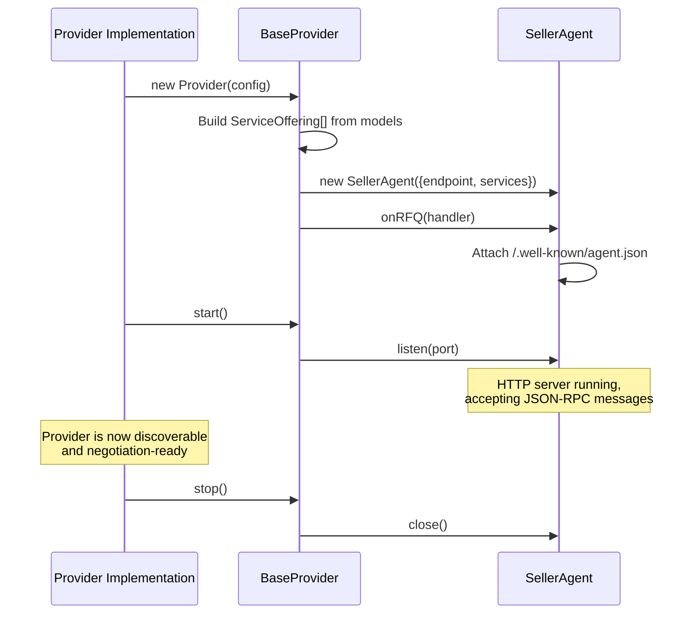
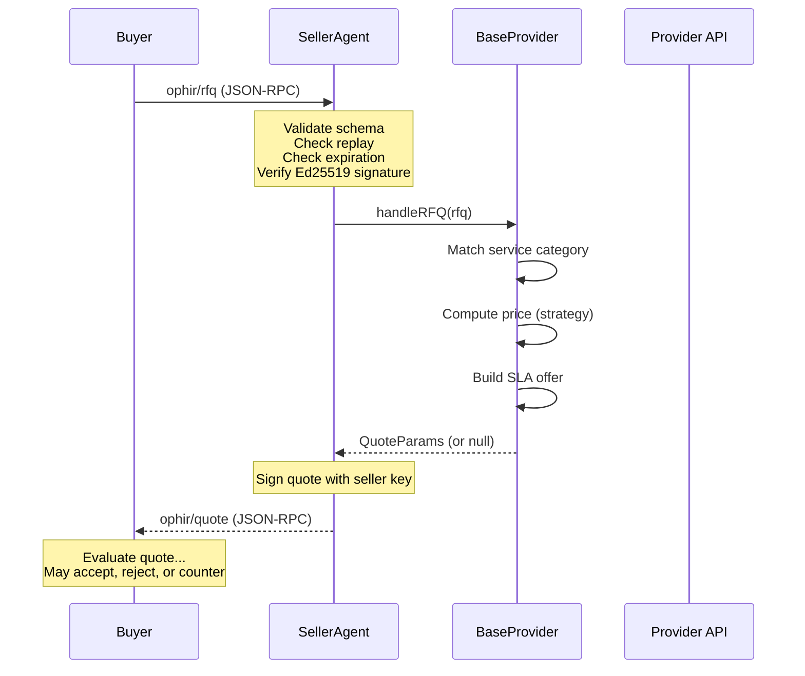
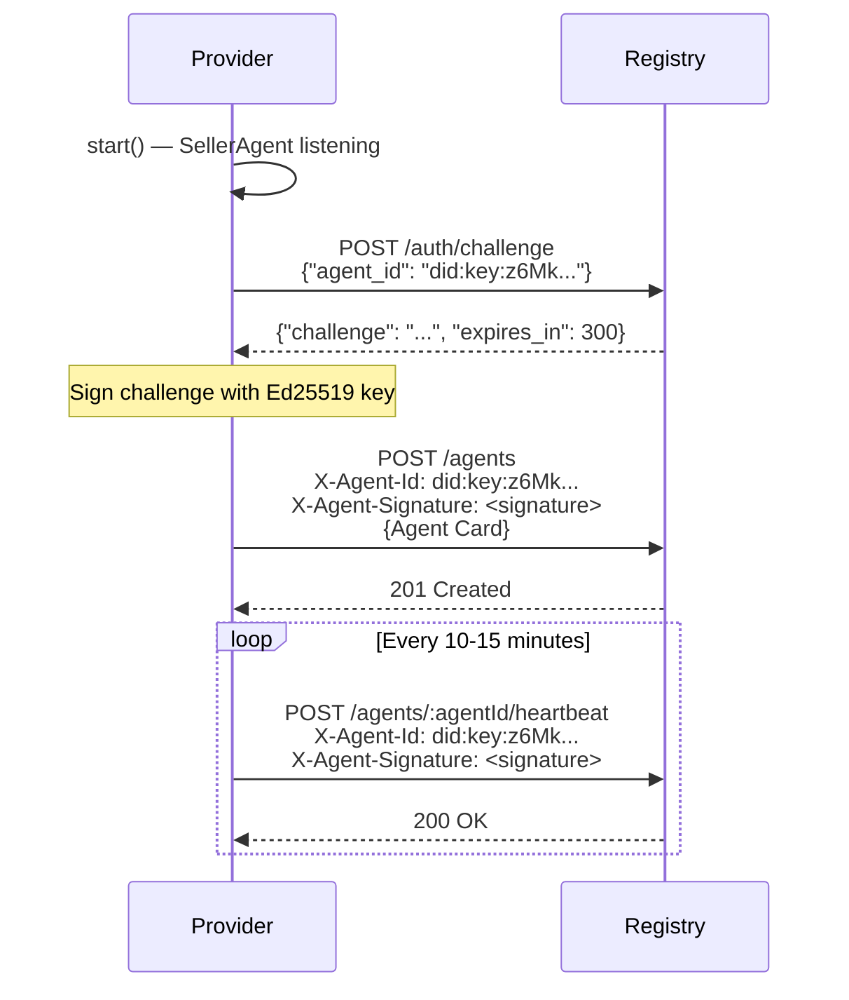
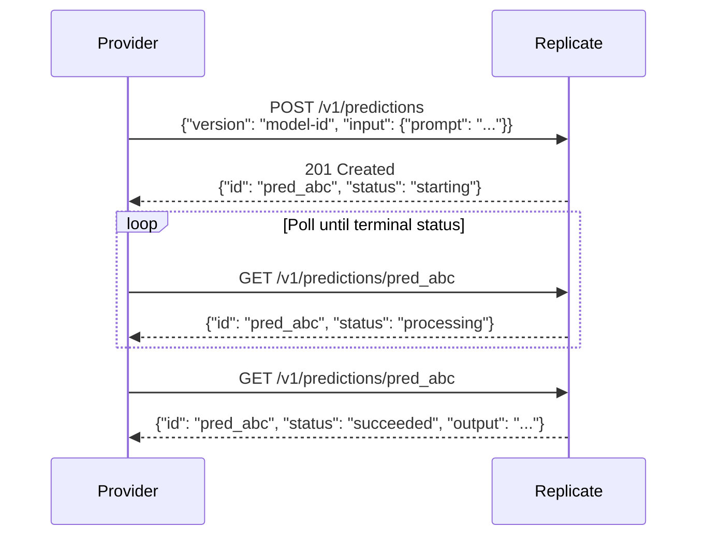

# Ophir Provider Protocol

**Version:** 1.0
**Status:** Draft
**Date:** 2026-03-05

## Abstract

The Ophir Provider Protocol defines how to wrap any AI inference API as an Ophir-compatible seller agent. A provider bridges the gap between a third-party AI service (OpenAI, Anthropic, Replicate, etc.) and the Ophir negotiation protocol, exposing the service's models as negotiable offerings with standardized pricing, SLA commitments, and metric reporting. This specification covers the `BaseProvider` pattern, service catalog construction, pricing strategies, RFQ handling, request execution, metric collection, and registry integration. It is designed so that any implementor can build a provider wrapper without reading the reference source code.

---

## Table of Contents

1. [Introduction](#1-introduction)
2. [Terminology](#2-terminology)
3. [Provider Architecture](#3-provider-architecture)
4. [Service Catalog](#4-service-catalog)
5. [Pricing](#5-pricing)
6. [RFQ Handling](#6-rfq-handling)
7. [Request Execution](#7-request-execution)
8. [Metric Reporting](#8-metric-reporting)
9. [Provider Registration](#9-provider-registration)
10. [Reference Implementations](#10-reference-implementations)
11. [Building a Custom Provider](#11-building-a-custom-provider)
12. [OpenAI-Compatible Providers](#12-openai-compatible-providers)
13. [Non-Standard Providers](#13-non-standard-providers)
14. [Security Considerations](#14-security-considerations)
15. [Backwards Compatibility](#15-backwards-compatibility)

---

## 1. Introduction

The Ophir protocol enables autonomous agents to negotiate service agreements over JSON-RPC 2.0. On the sell side, a **provider** is the component that turns a real AI API into an Ophir negotiation participant. A provider:

- Declares a **service catalog** listing available models with categories and pricing
- Runs a **SellerAgent** that receives RFQs, generates signed quotes, and finalizes agreements
- **Executes inference** by translating Ophir-standard request parameters into provider-specific API calls
- **Reports metrics** (latency, error rate, throughput) to support SLA enforcement and Lockstep Verification
- **Registers** with one or more Ophir registries for discovery by buyer agents

The protocol supports two broad provider patterns:

1. **OpenAI-compatible providers** — services that implement the OpenAI `/v1/chat/completions` wire format (OpenAI, Together, Groq, OpenRouter). These share a common request/response translator.
2. **Non-standard providers** — services with unique API shapes (Anthropic Messages API, Replicate async predictions). These require custom request translation logic.

---

## 2. Terminology

The key words "MUST", "MUST NOT", "REQUIRED", "SHALL", "SHALL NOT", "SHOULD", "SHOULD NOT", "RECOMMENDED", "MAY", and "OPTIONAL" in this document are to be interpreted as described in [RFC 2119](https://www.ietf.org/rfc/rfc2119.txt).

**Provider**
A software component that wraps a third-party AI API and exposes it as an Ophir seller agent.

**BaseProvider**
The abstract base class that all provider implementations extend. Defines the model catalog interface, SellerAgent lifecycle, and the `executeInference()` contract.

**SellerAgent**
The SDK component that handles Ophir negotiation protocol messages (RFQ, Quote, Counter, Accept, Reject) on behalf of the provider. Manages Ed25519 identity, signature verification, and session state.

**Service Catalog**
The set of `ServiceOffering` objects derived from a provider's model list. Each offering maps to one model and specifies its category, base price, currency, and pricing unit.

**Model Entry**
A record describing a single AI model available through the provider, including its identifier, human-readable name, service category, and per-million-token pricing.

**Inference Result**
The standardized response object returned by `executeInference()`, containing the model's output content, token usage, latency measurement, and optional raw provider response.

---

## 3. Provider Architecture

### 3.1 Component Diagram

```
┌──────────────────────────────────────────────────────┐
│                    BaseProvider                       │
│                                                      │
│  ┌─────────────┐  ┌──────────────┐  ┌─────────────┐ │
│  │ Model       │  │ SellerAgent  │  │ Metric      │ │
│  │ Catalog     │──│ (JSON-RPC    │  │ Collector   │ │
│  │ (models[])  │  │  server)     │  │             │ │
│  └─────────────┘  └──────┬───────┘  └──────┬──────┘ │
│                          │                  │        │
│  ┌───────────────────────┴──────────────────┘        │
│  │ executeInference()                                │
│  │ (abstract — provider-specific API call)           │
│  └───────────────────────────────────────────────────│
└──────────────────────────────────────────────────────┘
         │                         │
         ▼                         ▼
   ┌──────────┐            ┌────────────┐
   │ Provider │            │   Ophir    │
   │ API      │            │  Registry  │
   │ (OpenAI, │            │            │
   │ Anthropic│            └────────────┘
   │ etc.)    │
   └──────────┘
```

### 3.2 BaseProvider Interface

Every provider implementation MUST extend the `BaseProvider` abstract class and implement the following:

| Member | Type | Description |
|---|---|---|
| `name` | `readonly string` | Provider identifier (e.g., `"openai"`, `"anthropic"`) |
| `models` | `readonly Model[]` | Array of model entries with pricing (see [Section 4](#4-service-catalog)) |
| `executeInference(params)` | `async method` | Translates and executes a request against the provider's API |

### 3.3 Provider Configuration

Providers are configured via a `ProviderConfig` object:

```json
{
  "apiKey": "sk-...",
  "baseUrl": "https://api.openai.com/v1",
  "port": 8080,
  "endpoint": "https://provider.example.com",
  "registryEndpoints": ["https://registry.ophir.ai/v1"],
  "pricing": {
    "gpt-4o": { "input": 2.50, "output": 10.00, "unit": "1M_tokens" }
  }
}
```

| Field | Type | Required | Description |
|---|---|---|---|
| `apiKey` | string | No | API key for the upstream provider. Falls back to provider-specific environment variables. |
| `baseUrl` | string | No | Override the provider's default API base URL. |
| `port` | number | No | Port for the SellerAgent HTTP server. Default: `0` (random). |
| `endpoint` | string | No | Public endpoint URL. Auto-detected from port if not set. |
| `registryEndpoints` | string[] | No | Registry URLs to register with on startup. |
| `pricing` | object | No | Per-model pricing overrides (see [Section 5](#5-pricing)). |

### 3.4 SellerAgent Integration

On construction, the provider:

1. Builds `ServiceOffering[]` from the model catalog
2. Creates a `SellerAgent` with the provider's endpoint and service offerings
3. Registers an RFQ handler on the SellerAgent
4. Attaches `/.well-known/agent.json` to the SellerAgent's HTTP server

The SellerAgent manages:
- **Ed25519 keypair generation** — auto-generated if not provided
- **`did:key` identity** — derived from the public key with multicodec prefix `0xed01`, base58-btc encoded
- **JSON-RPC message handling** — RFQ, Counter, Accept, Reject methods
- **Signature verification** — validates buyer signatures on all incoming messages
- **Quote signing** — signs all outgoing quotes with the seller's private key
- **Replay protection** — deduplicates message IDs within a configurable window

### 3.5 Lifecycle



---

## 4. Service Catalog

### 4.1 Model Entry Format

Each provider MUST declare a `models` array. Each entry describes a single model:

```json
{
  "id": "gpt-4o",
  "name": "GPT-4o",
  "category": "inference",
  "inputPrice": 2.50,
  "outputPrice": 10.00
}
```

| Field | Type | Description |
|---|---|---|
| `id` | string | The model identifier used in API calls to the upstream provider |
| `name` | string | Human-readable model name |
| `category` | string | Service category — used to match against RFQ `service.category` |
| `inputPrice` | number | Price per 1 million input tokens (in the provider's pricing currency) |
| `outputPrice` | number | Price per 1 million output tokens. MAY be `0` for embedding models. |

### 4.2 Standard Categories

Providers SHOULD use these standard category values to ensure interoperability with buyer agents:

| Category | Description | Examples |
|---|---|---|
| `inference` | Chat completion / text generation | GPT-4o, Claude Sonnet 4.6, Llama 3 70B |
| `embedding` | Text embedding / vector generation | text-embedding-3-large, M2 BERT |
| `image_generation` | Image synthesis | SDXL, DALL-E |
| `translation` | Language translation | — |
| `data_processing` | General data processing | — |

Custom categories MAY be used. Buyer agents that do not recognize a category SHOULD ignore offerings in that category.

### 4.3 Service Offering Construction

The provider MUST convert its model catalog into `ServiceOffering[]` objects for the SellerAgent. Each model entry produces one service offering:

```json
{
  "category": "inference",
  "description": "GPT-4o via openai",
  "base_price": "2.500000",
  "currency": "USDC",
  "unit": "1M_tokens",
  "capacity": 100
}
```

| Field | Type | Description |
|---|---|---|
| `category` | string | Copied from the model entry |
| `description` | string | `"{model.name} via {provider.name}"` |
| `base_price` | string | The model's `inputPrice` formatted to 6 decimal places |
| `currency` | string | MUST be `"USDC"` in protocol version 1.0 |
| `unit` | string | MUST be `"1M_tokens"` for token-priced models |
| `capacity` | number | Maximum concurrent requests (default: `100`) |

### 4.4 Price Resolution

When constructing service offerings, the provider MUST check for pricing overrides before falling back to model defaults:

1. If `config.pricing[modelId]` exists, use the override values
2. Otherwise, use the model entry's `inputPrice` / `outputPrice`
3. If the model ID is not found, the price is `0`

---

## 5. Pricing

### 5.1 Static Pricing

The simplest pricing model. The provider advertises a fixed `base_price` derived from its model catalog. Quotes generated from static pricing use the `"fixed"` pricing model.

A provider using static pricing MUST set the SellerAgent's pricing strategy to `{ type: "fixed" }`. This is the default.

### 5.2 Competitive Pricing

A provider MAY use competitive pricing to undercut market rates. When the pricing strategy is `{ type: "competitive" }`, the quote price is computed as:

```
quote_price = base_price × 0.9
```

This applies a 10% discount to attract buyer agents in competitive markets.

### 5.3 Dynamic Pricing

Dynamic pricing adjusts the price based on real-time conditions. The formula takes a base price and a `PricingContext`:

```json
{
  "currentLoad": 0.85,
  "demandMultiplier": 1.2,
  "timeOfDay": 14
}
```

| Field | Type | Description |
|---|---|---|
| `currentLoad` | number | Current provider utilization, `0.0` to `1.0` |
| `demandMultiplier` | number | Multiplier from recent RFQ volume |
| `timeOfDay` | number | UTC hour, `0` to `23` |

**Dynamic price formula:**

```
multiplier = 1.0

IF currentLoad > 0.8:
    t = (currentLoad - 0.8) / 0.2
    multiplier = multiplier × (1 + t × 0.5)
    // At load 1.0: 1.5× multiplier
ELSE IF currentLoad < 0.2:
    t = currentLoad / 0.2
    multiplier = multiplier × (0.8 + t × 0.2)
    // At load 0.0: 0.8× multiplier

multiplier = multiplier × demandMultiplier

IF timeOfDay >= 0 AND timeOfDay < 8:
    multiplier = multiplier × 0.9   // Off-peak discount

dynamic_price = base_price × multiplier
```

**Pricing bands summary:**

| Condition | Multiplier Range |
|---|---|
| Load > 80% | 1.0× to 1.5× (linear) |
| Load 20%–80% | 1.0× (neutral) |
| Load < 20% | 0.8× to 1.0× (linear) |
| Off-peak (UTC 0–8) | Additional 0.9× |
| Demand multiplier | Applied multiplicatively |

### 5.4 Price Unit Conventions

All prices in the Ophir protocol MUST be expressed as decimal strings in the specified currency. The standard pricing unit for token-based models is `"1M_tokens"` (per one million tokens).

| Unit | Description |
|---|---|
| `1M_tokens` | Per one million tokens (input or output) |
| `request` | Per individual request |
| `MB` | Per megabyte of data |

Implementations MAY define custom units. Buyer agents that do not recognize a unit SHOULD reject quotes using that unit.

### 5.5 Volume Discounts

Quotes MAY include volume discount tiers:

```json
{
  "volume_discounts": [
    { "min_units": 1000, "price_per_unit": "2.2500" },
    { "min_units": 10000, "price_per_unit": "2.0000" }
  ]
}
```

The default volume discounts offer 10% off at 1,000 units and 20% off at 10,000 units.

---

## 6. RFQ Handling

### 6.1 Receiving an RFQ

When a buyer agent sends an RFQ (Request for Quote), the SellerAgent:

1. **Validates** the JSON-RPC message against the `RFQParams` schema
2. **Deduplicates** the `rfq_id` against its replay protection window
3. **Checks expiration** — rejects RFQs whose `expires_at` timestamp has passed
4. **Verifies the buyer's Ed25519 signature** over the unsigned RFQ payload
5. **Creates a NegotiationSession** to track the negotiation state
6. **Dispatches** to the provider's RFQ handler

### 6.2 Quote Generation

The provider's RFQ handler receives the validated `RFQParams` and MUST return either a `QuoteParams` object or `null` (to ignore the RFQ).

The default quote generation logic:

1. **Match service** — find a `ServiceOffering` whose `category` matches `rfq.service.category`
2. If no match is found, return `null`
3. **Compute price** — apply the pricing strategy to the matched service's `base_price`
4. **Build SLA offer** — include default SLA metrics:

```json
{
  "metrics": [
    { "name": "uptime_pct", "target": 99.9, "comparison": "gte" },
    { "name": "p99_latency_ms", "target": 500, "comparison": "lte" },
    { "name": "accuracy_pct", "target": 95, "comparison": "gte" }
  ],
  "dispute_resolution": {
    "method": "lockstep_verification",
    "timeout_hours": 24
  }
}
```

5. **Set expiration** — quote expires after the configured timeout (default: 5 minutes)
6. **Sign the quote** — Ed25519 signature over the JCS-canonicalized unsigned payload

### 6.3 Quote Wire Format

```json
{
  "jsonrpc": "2.0",
  "method": "ophir/quote",
  "params": {
    "quote_id": "f47ac10b-58cc-4372-a567-0e02b2c3d479",
    "rfq_id": "550e8400-e29b-41d4-a716-446655440000",
    "seller": {
      "agent_id": "did:key:z6MkhaXgBZDvotDkL5257faiztiGiC2QtKLGpbnnEGta2doK",
      "endpoint": "https://provider.example.com"
    },
    "pricing": {
      "price_per_unit": "2.5000",
      "currency": "USDC",
      "unit": "1M_tokens",
      "pricing_model": "fixed",
      "volume_discounts": [
        { "min_units": 1000, "price_per_unit": "2.2500" },
        { "min_units": 10000, "price_per_unit": "2.0000" }
      ]
    },
    "sla_offered": {
      "metrics": [
        { "name": "uptime_pct", "target": 99.9, "comparison": "gte" },
        { "name": "p99_latency_ms", "target": 500, "comparison": "lte" },
        { "name": "accuracy_pct", "target": 95, "comparison": "gte" }
      ],
      "dispute_resolution": {
        "method": "lockstep_verification",
        "timeout_hours": 24
      }
    },
    "expires_at": "2026-03-05T12:05:00.000Z",
    "signature": "base64-encoded-ed25519-signature"
  },
  "id": 1
}
```

### 6.4 Custom RFQ Handlers

Providers MAY register a custom RFQ handler to implement advanced logic:

```
provider.seller.onRFQ(async (rfq) => {
    // Check budget constraints
    if (parseFloat(rfq.budget.max_price_per_unit) < 0.005) {
        return null;  // Too cheap, ignore
    }
    // Use default quote generation
    return provider.seller.generateQuote(rfq);
});
```

When a custom handler returns a `QuoteParams`, the SellerAgent MUST re-sign the quote with the seller's private key to ensure cryptographic integrity, as custom handlers may produce quotes with placeholder signatures.

### 6.5 Counter-Offer Handling

Providers MAY register a counter-offer handler. When a buyer sends a counter-offer, the handler receives the `CounterParams` and the current `NegotiationSession`, and MUST return one of:

- A new `QuoteParams` — continue negotiation with a revised offer
- `"accept"` — accept the buyer's counter-offer terms
- `"reject"` — reject and end the negotiation

If no counter handler is registered, the SellerAgent acknowledges receipt but takes no automated action.

### 6.6 RFQ Processing Sequence



---

## 7. Request Execution

### 7.1 The executeInference Contract

After a negotiation concludes with an accepted agreement, the buyer sends inference requests to the provider. Every provider MUST implement the `executeInference()` method:

**Input parameters:**

```json
{
  "model": "gpt-4o",
  "messages": [
    { "role": "system", "content": "You are a helpful assistant." },
    { "role": "user", "content": "Hello, world!" }
  ],
  "temperature": 0.7,
  "max_tokens": 1024
}
```

| Field | Type | Required | Description |
|---|---|---|---|
| `model` | string | Yes | Model identifier from the provider's catalog |
| `messages` | object[] | Yes | Chat messages in `{role, content}` format |
| `temperature` | number | No | Sampling temperature |
| `max_tokens` | number | No | Maximum tokens to generate |

**Output — InferenceResult:**

```json
{
  "content": "Hello! How can I help you today?",
  "model": "gpt-4o",
  "usage": {
    "prompt_tokens": 25,
    "completion_tokens": 9,
    "total_tokens": 34
  },
  "latencyMs": 342.5,
  "raw": { "...provider-specific response..." }
}
```

| Field | Type | Description |
|---|---|---|
| `content` | string | The model's generated text response |
| `model` | string | The model that actually served the request |
| `usage.prompt_tokens` | number | Input tokens consumed |
| `usage.completion_tokens` | number | Output tokens generated |
| `usage.total_tokens` | number | Sum of prompt and completion tokens |
| `latencyMs` | number | End-to-end latency in milliseconds |
| `raw` | unknown | Optional raw provider response for advanced use |

### 7.2 API Key Resolution

Providers MUST resolve API keys in the following order:

1. `config.apiKey` (explicitly provided at construction)
2. Provider-specific environment variable (fallback)

Standard environment variable names:

| Provider | Environment Variable |
|---|---|
| OpenAI | `OPENAI_API_KEY` |
| Anthropic | `ANTHROPIC_API_KEY` |
| Together | `TOGETHER_API_KEY` |
| Groq | `GROQ_API_KEY` |
| OpenRouter | `OPENROUTER_API_KEY` |
| Replicate | `REPLICATE_API_TOKEN` |

If no API key is available, the provider MUST throw an error with a message indicating which key or environment variable is required.

### 7.3 Latency Measurement

Providers MUST measure end-to-end latency using a high-resolution timer:

1. Record the start time immediately before sending the HTTP request
2. Record the end time immediately after receiving the complete response
3. Compute `latencyMs = endTime - startTime`

The measured latency MUST be included in the `InferenceResult` and SHOULD be recorded in the `MetricCollector` as a `p99_latency_ms` observation.

### 7.4 Retry Logic

Providers SHOULD implement retry logic for transient failures:

- **Trigger:** HTTP status `429 Too Many Requests`
- **Maximum retries:** 3 (configurable)
- **Backoff strategy:** Exponential — `delay = 2^attempt × 1000ms`, or use the `Retry-After` header value if provided
- **Non-retryable errors:** All other HTTP error statuses MUST NOT be retried

---

## 8. Metric Reporting

### 8.1 MetricCollector

Each provider instance MUST maintain a `MetricCollector` that records observations for SLA-relevant metrics. The collector supports the following aggregation methods:

| Method | Description |
|---|---|
| `rolling_average` | Mean of observations in the measurement window |
| `percentile` | 99th percentile of sorted observations |
| `count` | Number of observations in the window |
| `rate` | Sum of values divided by window duration in minutes |
| `instant` | Most recent observation |

### 8.2 Required Metrics

Providers MUST record the following metric after each inference request:

| Metric | When Recorded | Value |
|---|---|---|
| `p99_latency_ms` | After each `executeInference()` call | End-to-end latency in milliseconds |

Providers SHOULD also record:

| Metric | Description |
|---|---|
| `error_rate_pct` | Percentage of requests that failed |
| `throughput_rpm` | Requests processed per minute |
| `uptime_pct` | Availability percentage |

### 8.3 SLA Evaluation

The MetricCollector evaluates metrics against a Lockstep Verification spec's behavioral checks. For each check:

1. Aggregate the metric over the measurement window using the specified method
2. Compare the aggregated value against the threshold using the specified operator (`gte`, `lte`, `eq`)
3. If the check fails, increment the consecutive failure counter
4. If consecutive failures exceed the policy threshold (default: 3), and the cooldown period has elapsed (default: 300 seconds), emit a `Violation`

### 8.4 Violation Format

```json
{
  "violation_id": "a3f1b9c2-d4e5-4a7b-8c9d-0e1f2a3b4c5d",
  "agreement_id": "agr_12345",
  "agreement_hash": "sha256-hash-of-agreement",
  "metric": "p99_latency_ms",
  "threshold": 500,
  "observed": 723.4,
  "operator": "lte",
  "measurement_window": "PT1H",
  "sample_count": 150,
  "timestamp": "2026-03-05T14:30:00.000Z",
  "consecutive_count": 3,
  "samples": [ "...metric samples..." ],
  "evidence_hash": "sha256-hash-of-samples"
}
```

Violations are used as evidence in the Lockstep Verification dispute resolution process. See the [Lockstep Verification Protocol Specification](LOCKSTEP.md) for details.

### 8.5 Metric Retention

The MetricCollector MUST retain observations for a configurable retention period (default: 168 hours / 7 days). Observations older than the retention window MUST be evicted to prevent unbounded memory growth.

---

## 9. Provider Registration

### 9.1 Well-Known Discovery

When started, the provider's SellerAgent automatically serves an A2A-compatible Agent Card at:

```
GET /.well-known/agent.json
```

**Example response:**

```json
{
  "name": "Seller z6Mk...doK",
  "description": "Ophir-compatible seller agent",
  "url": "https://provider.example.com",
  "capabilities": {
    "negotiation": {
      "supported": true,
      "endpoint": "https://provider.example.com",
      "protocols": ["ophir/1.0"],
      "acceptedPayments": [
        { "network": "solana", "token": "USDC" }
      ],
      "negotiationStyles": ["rfq"],
      "maxNegotiationRounds": 5,
      "services": [
        {
          "category": "inference",
          "description": "GPT-4o via openai",
          "base_price": "2.500000",
          "currency": "USDC",
          "unit": "1M_tokens"
        }
      ]
    }
  }
}
```

### 9.2 Registry Registration

Providers MAY register with one or more Ophir registries for broader discovery. Registration follows the [Ophir Agent Registry Protocol](REGISTRY.md):

1. Request an authentication challenge from the registry
2. Sign the challenge with the provider's Ed25519 private key
3. Submit the Agent Card to `POST /agents` with authentication headers
4. Maintain liveness via periodic heartbeats (`POST /agents/:agentId/heartbeat`)

### 9.3 Registration Sequence



---

## 10. Reference Implementations

The Ophir project includes 6 reference provider implementations. All extend `BaseProvider` and follow the patterns described in this specification.

### 10.1 OpenAI Provider

| Property | Value |
|---|---|
| Name | `openai` |
| Base URL | `https://api.openai.com/v1` |
| API Key Env | `OPENAI_API_KEY` |
| Auth Header | `Authorization: Bearer <key>` |
| Pattern | Native implementation with own `fetchWithRetry` |

**Models:**

| ID | Name | Category | Input Price | Output Price |
|---|---|---|---|---|
| `gpt-4o` | GPT-4o | inference | $2.50 | $10.00 |
| `gpt-4o-mini` | GPT-4o Mini | inference | $0.15 | $0.60 |
| `gpt-3.5-turbo` | GPT-3.5 Turbo | inference | $0.50 | $1.50 |
| `text-embedding-3-large` | Embedding 3 Large | embedding | $0.13 | $0.00 |

### 10.2 Anthropic Provider

| Property | Value |
|---|---|
| Name | `anthropic` |
| Base URL | `https://api.anthropic.com/v1` |
| API Key Env | `ANTHROPIC_API_KEY` |
| Auth Header | `x-api-key: <key>` + `anthropic-version: 2023-06-01` |
| Pattern | Non-standard (Messages API) |

**Message format translation:**
- System messages are extracted from the messages array and sent as the top-level `system` parameter
- The `max_tokens` parameter defaults to `4096` if not specified
- Response content blocks are filtered for `type: "text"` to extract the text response
- Token usage fields are mapped: `input_tokens` → `prompt_tokens`, `output_tokens` → `completion_tokens`

**Models:**

| ID | Name | Category | Input Price | Output Price |
|---|---|---|---|---|
| `claude-sonnet-4-6` | Claude Sonnet 4.6 | inference | $3.00 | $15.00 |
| `claude-haiku-4-5-20251001` | Claude Haiku 4.5 | inference | $0.80 | $4.00 |

### 10.3 Together Provider

| Property | Value |
|---|---|
| Name | `together` |
| Base URL | `https://api.together.xyz/v1` |
| API Key Env | `TOGETHER_API_KEY` |
| Pattern | OpenAI-compatible |

**Models:**

| ID | Name | Category | Input Price | Output Price |
|---|---|---|---|---|
| `meta-llama/Llama-3-70b-chat-hf` | Llama 3 70B | inference | $0.90 | $0.90 |
| `meta-llama/Llama-3-8b-chat-hf` | Llama 3 8B | inference | $0.20 | $0.20 |
| `mistralai/Mixtral-8x7B-Instruct-v0.1` | Mixtral 8x7B | inference | $0.60 | $0.60 |
| `togethercomputer/m2-bert-80M-8k-retrieval` | M2 BERT Retrieval | embedding | $0.008 | $0.00 |

### 10.4 Groq Provider

| Property | Value |
|---|---|
| Name | `groq` |
| Base URL | `https://api.groq.com/openai/v1` |
| API Key Env | `GROQ_API_KEY` |
| Pattern | OpenAI-compatible |

**Models:**

| ID | Name | Category | Input Price | Output Price |
|---|---|---|---|---|
| `llama3-70b-8192` | Llama 3 70B (Groq) | inference | $0.59 | $0.79 |
| `llama3-8b-8192` | Llama 3 8B (Groq) | inference | $0.05 | $0.08 |
| `mixtral-8x7b-32768` | Mixtral 8x7B (Groq) | inference | $0.24 | $0.24 |
| `gemma-7b-it` | Gemma 7B (Groq) | inference | $0.07 | $0.07 |

### 10.5 OpenRouter Provider

| Property | Value |
|---|---|
| Name | `openrouter` |
| Base URL | `https://openrouter.ai/api/v1` |
| API Key Env | `OPENROUTER_API_KEY` |
| Pattern | OpenAI-compatible |

**Models:**

| ID | Name | Category | Input Price | Output Price |
|---|---|---|---|---|
| `openai/gpt-4o` | GPT-4o (via OpenRouter) | inference | $2.50 | $10.00 |
| `anthropic/claude-sonnet-4-6` | Claude Sonnet 4.6 (via OpenRouter) | inference | $3.00 | $15.00 |
| `meta-llama/llama-3-70b-instruct` | Llama 3 70B (via OpenRouter) | inference | $0.59 | $0.79 |
| `google/gemini-pro` | Gemini Pro (via OpenRouter) | inference | $0.125 | $0.375 |
| `mistralai/mixtral-8x7b-instruct` | Mixtral 8x7B (via OpenRouter) | inference | $0.24 | $0.24 |

### 10.6 Replicate Provider

| Property | Value |
|---|---|
| Name | `replicate` |
| Base URL | `https://api.replicate.com/v1` |
| API Key Env | `REPLICATE_API_TOKEN` |
| Pattern | Non-standard (async predictions) |

**Models:**

| ID | Name | Category | Input Price | Output Price |
|---|---|---|---|---|
| `meta/llama-3-70b-instruct` | Llama 3 70B (Replicate) | inference | $0.65 | $2.75 |
| `stability-ai/sdxl` | SDXL (Replicate) | image_generation | $0.002 | $0.00 |
| `meta/meta-llama-3-8b-instruct` | Llama 3 8B (Replicate) | inference | $0.05 | $0.25 |

See [Section 13](#13-non-standard-providers) for details on Replicate's async prediction handling.

---

## 11. Building a Custom Provider

### 11.1 Step 1: Extend BaseProvider

Create a new class that extends `BaseProvider` and declares the `name` and `models`:

```typescript
import { BaseProvider } from '@ophirai/providers';
import type { ProviderConfig, InferenceResult } from '@ophirai/providers';

export class MyCustomProvider extends BaseProvider {
  readonly name = 'my-provider';
  readonly models = [
    {
      id: 'my-model-v1',
      name: 'My Model v1',
      category: 'inference',
      inputPrice: 1.00,
      outputPrice: 3.00,
    },
  ];

  constructor(config: ProviderConfig = {}) {
    super(config);
  }

  async executeInference(params: {
    model: string;
    messages: Array<{ role: string; content: string }>;
    temperature?: number;
    max_tokens?: number;
  }): Promise<InferenceResult> {
    const apiKey = this.config.apiKey ?? process.env.MY_PROVIDER_API_KEY;
    if (!apiKey) throw new Error('My Provider API key required');

    const start = performance.now();

    // ... translate params and call your API ...

    const latencyMs = performance.now() - start;
    this.metrics.record('p99_latency_ms', latencyMs);

    return {
      content: '...',
      model: params.model,
      usage: { prompt_tokens: 0, completion_tokens: 0, total_tokens: 0 },
      latencyMs,
    };
  }
}
```

### 11.2 Step 2: Start the Provider

```typescript
const provider = new MyCustomProvider({
  apiKey: 'my-api-key',
  port: 8080,
});

await provider.start();
console.log(`Provider running at ${provider.getEndpoint()}`);
console.log(`Agent ID: ${provider.getAgentId()}`);
```

### 11.3 Step 3: Register with a Registry (Optional)

Registration uses the Ophir Agent Registry Protocol. The provider's SellerAgent provides the `did:key` identity and Agent Card needed for registration.

### 11.4 Step 4: Customize RFQ Handling (Optional)

Override the default quote generation by calling `onRFQ` on the underlying SellerAgent:

```typescript
// Access the SellerAgent for custom handlers
provider.seller.onRFQ(async (rfq) => {
  // Custom budget validation
  const maxPrice = parseFloat(rfq.budget.max_price_per_unit);
  if (maxPrice < 0.50) return null;

  // Custom dynamic pricing
  const context = { currentLoad: getSystemLoad(), demandMultiplier: 1, timeOfDay: new Date().getUTCHours() };
  // ... apply dynamic pricing ...

  return provider.seller.generateQuote(rfq);
});
```

---

## 12. OpenAI-Compatible Providers

### 12.1 Shared Request Pattern

Many AI providers implement the OpenAI `/v1/chat/completions` API format. These providers share a common request/response translator (`openaiCompatibleRequest`) that:

1. Constructs the request body with `model`, `messages`, `stream: false`, and optional `temperature`/`max_tokens`
2. Sends a POST to `{baseUrl}/chat/completions` with `Authorization: Bearer <key>`
3. Measures latency around the full request lifecycle
4. Parses the OpenAI-compatible response format
5. Returns a normalized `InferenceResult`

### 12.2 OpenAI-Compatible Chat Response Format

```json
{
  "id": "chatcmpl-abc123",
  "object": "chat.completion",
  "model": "gpt-4o",
  "choices": [
    {
      "index": 0,
      "message": { "role": "assistant", "content": "Hello!" },
      "finish_reason": "stop"
    }
  ],
  "usage": {
    "prompt_tokens": 10,
    "completion_tokens": 5,
    "total_tokens": 15
  }
}
```

### 12.3 Error Response Format

```json
{
  "error": {
    "message": "Rate limit exceeded",
    "type": "rate_limit_error",
    "code": "rate_limit_exceeded"
  }
}
```

### 12.4 Implementing a New OpenAI-Compatible Provider

To add a new provider that uses the OpenAI-compatible format:

```typescript
import { BaseProvider } from '@ophirai/providers';
import { openaiCompatibleRequest } from '@ophirai/providers';
import type { ProviderConfig, InferenceResult } from '@ophirai/providers';

export class NewCompatProvider extends BaseProvider {
  readonly name = 'new-provider';
  readonly models = [
    { id: 'model-a', name: 'Model A', category: 'inference', inputPrice: 0.50, outputPrice: 1.00 },
  ];

  constructor(config: ProviderConfig = {}) {
    super(config);
  }

  async executeInference(params: {
    model: string;
    messages: Array<{ role: string; content: string }>;
    temperature?: number;
    max_tokens?: number;
  }): Promise<InferenceResult> {
    const apiKey = this.config.apiKey ?? process.env.NEW_PROVIDER_API_KEY;
    if (!apiKey) throw new Error('API key required');

    const result = await openaiCompatibleRequest({
      baseUrl: this.config.baseUrl ?? 'https://api.new-provider.com/v1',
      apiKey,
      model: params.model,
      messages: params.messages,
      temperature: params.temperature,
      max_tokens: params.max_tokens,
      providerName: 'NewProvider',
    });

    this.metrics.record('p99_latency_ms', result.latencyMs);
    return result;
  }
}
```

The `openaiCompatibleRequest` function handles retry logic, latency measurement, and response parsing automatically.

---

## 13. Non-Standard Providers

### 13.1 Anthropic Messages API

The Anthropic API uses a different request and response format from the OpenAI standard:

**Key differences:**

| Aspect | OpenAI Format | Anthropic Format |
|---|---|---|
| Endpoint | `/v1/chat/completions` | `/v1/messages` |
| Auth header | `Authorization: Bearer <key>` | `x-api-key: <key>` |
| API version | Not required | `anthropic-version: 2023-06-01` |
| System message | In messages array | Top-level `system` field |
| Response content | `choices[0].message.content` (string) | `content[].text` (array of blocks) |
| Token usage | `prompt_tokens`, `completion_tokens` | `input_tokens`, `output_tokens` |
| `max_tokens` | Optional | Required (default: 4096) |

**Translation requirements:**

1. Extract any message with `role: "system"` from the messages array and pass it as the `system` parameter
2. Map remaining messages to `{role: "user" | "assistant", content: string}` format
3. Set `max_tokens` to `params.max_tokens ?? 4096`
4. Extract text from the response's `content` array by finding the first block with `type: "text"`
5. Map `input_tokens` → `prompt_tokens` and `output_tokens` → `completion_tokens`

### 13.2 Replicate Async Predictions

The Replicate API uses an asynchronous prediction model that requires polling:

**Request flow:**



**Key differences:**

| Aspect | Standard | Replicate |
|---|---|---|
| Request model | Synchronous | Async (create + poll) |
| Message format | Chat messages array | Concatenated `"role: content"` prompt string |
| Response format | Structured JSON | String, array of strings, or array of URLs |
| Token usage | Reported by API | Not available (`0` for all fields) |
| Latency | Single request | Includes poll wait time |

**Prediction statuses:**

| Status | Terminal | Description |
|---|---|---|
| `starting` | No | Prediction is being initialized |
| `processing` | No | Model is running |
| `succeeded` | Yes | Prediction completed successfully |
| `failed` | Yes | Prediction encountered an error |
| `canceled` | Yes | Prediction was canceled |

**Poll configuration:**

| Parameter | Default | Description |
|---|---|---|
| Poll interval | 1000 ms | Time between status checks |
| Max poll attempts | 120 | Maximum number of polls before timeout |

**Output handling:**

The prediction output varies by model type:
- **Text models**: String or array of strings (concatenated)
- **Image models**: Array of URLs pointing to generated images

The provider MUST handle all output types by converting them to a string representation.

### 13.3 General Guidance for Non-Standard APIs

When implementing a provider for a non-standard API:

1. **Extend `BaseProvider`** — all providers share the same lifecycle and integration pattern
2. **Implement `executeInference()`** — translate the standard Ophir request format to your API's format
3. **Normalize the response** — always return a complete `InferenceResult` with all required fields
4. **Record metrics** — call `this.metrics.record('p99_latency_ms', latencyMs)` after each request
5. **Handle missing data** — if the API does not report token usage, set usage fields to `0`
6. **Implement retries** — use `fetchWithRetry` from `openai-compat.ts` or implement your own retry logic

---

## 14. Security Considerations

### 14.1 API Key Management

API keys for upstream providers represent the most sensitive data in a provider deployment.

**Requirements:**
- Providers MUST NOT log, serialize, or transmit API keys in plaintext outside the provider process
- API keys SHOULD be provided via environment variables rather than configuration files
- Providers MUST NOT include API keys in Agent Cards, well-known documents, or any data sent to registries or buyer agents
- In multi-tenant deployments, API keys MUST be isolated per provider instance

### 14.2 Rate Limiting

Providers are exposed to two rate limiting concerns:

1. **Upstream rate limits** — the provider API's own rate limits (HTTP 429). Providers MUST implement retry with backoff (see [Section 7.4](#74-retry-logic)).
2. **Inbound request limiting** — providers SHOULD implement rate limiting on their SellerAgent HTTP server to prevent abuse by buyer agents. The SellerAgent's replay protection window provides some protection against repeated identical messages.

### 14.3 Signature Verification

All incoming negotiation messages (RFQ, Counter, Accept, Reject) are verified by the SellerAgent before reaching the provider:

- **RFQs**: Buyer's Ed25519 signature is verified over the unsigned RFQ payload
- **Counters**: Counter-sender's signature is verified; sender MUST match the original RFQ buyer
- **Accepts**: Buyer's signature is verified; agreement hash is validated against final terms
- **Rejects**: Rejecting agent's signature is verified

Providers MUST NOT bypass or disable signature verification.

### 14.4 Replay Protection

The SellerAgent maintains a seen-message-ID set to prevent replay attacks. Message IDs are tracked within a configurable replay protection window. Duplicate message IDs within the window are rejected with an `OPHIR_DUPLICATE_MESSAGE` error.

The seen-ID set is periodically evicted when it exceeds 1,000 entries to prevent memory exhaustion.

### 14.5 Transport Security

All provider API communications MUST use HTTPS (TLS 1.2 or later) in production deployments. This applies to:
- Outbound calls to upstream provider APIs
- Inbound negotiation messages from buyer agents
- Registry communication

### 14.6 Input Validation

The SellerAgent validates all incoming messages against Zod schemas (`RFQParamsSchema`, `CounterParamsSchema`, `AcceptParamsSchema`, `RejectParamsSchema`) before processing. Providers that implement custom RFQ handlers MUST NOT bypass this validation.

---

## 15. Backwards Compatibility

### 15.1 Provider Interface Stability

The `BaseProvider` abstract class defines the stable public API:
- `name` (readonly)
- `models` (readonly)
- `executeInference(params)` (abstract)
- `start()`, `stop()`, `getEndpoint()`, `getAgentId()`

Adding new optional fields to `ProviderConfig` or `InferenceResult` is backwards-compatible and MUST NOT require a version bump.

### 15.2 Model Catalog Evolution

Providers MAY add or remove models from their catalog at any time. Changes to the model catalog affect the service offerings advertised in the Agent Card.

- Adding models is backwards-compatible
- Removing models MAY break existing agreements that reference the removed model. Providers SHOULD honor active agreements even after removing a model from the catalog.

### 15.3 Service Offering Extension

The `ServiceOffering` type is extensible. Unknown fields in service offerings MUST be preserved by registries and SHOULD be ignored by buyer agents that do not recognize them.

### 15.4 Pricing Unit Compatibility

New pricing units MAY be introduced. Buyer agents that do not recognize a pricing unit SHOULD skip that offering in discovery results rather than failing.

### 15.5 Protocol Version

All providers advertise `protocols: ["ophir/1.0"]` in their Agent Card. Future protocol versions MUST be introduced as additional entries in the protocols array, not as replacements, to allow gradual migration.
