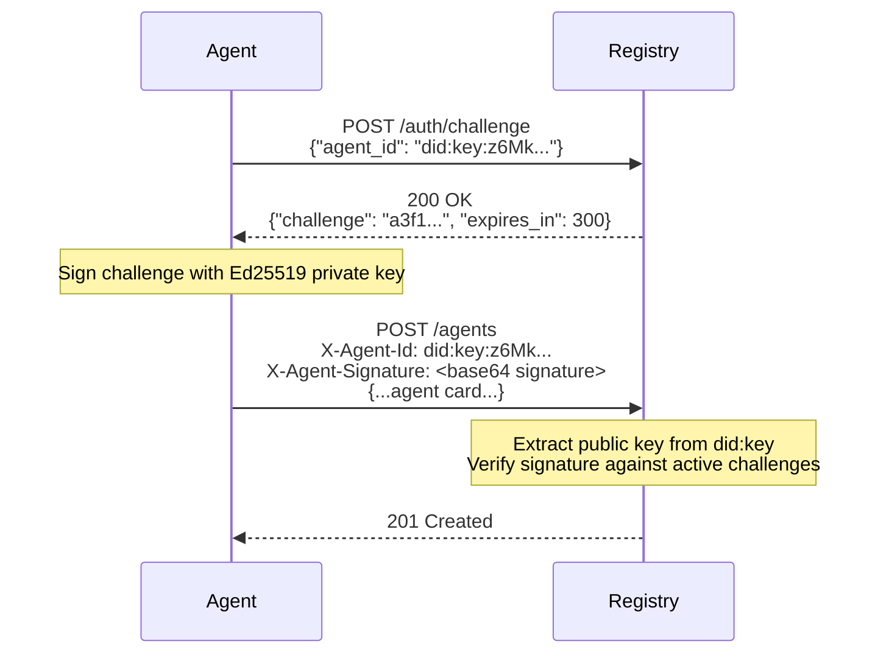
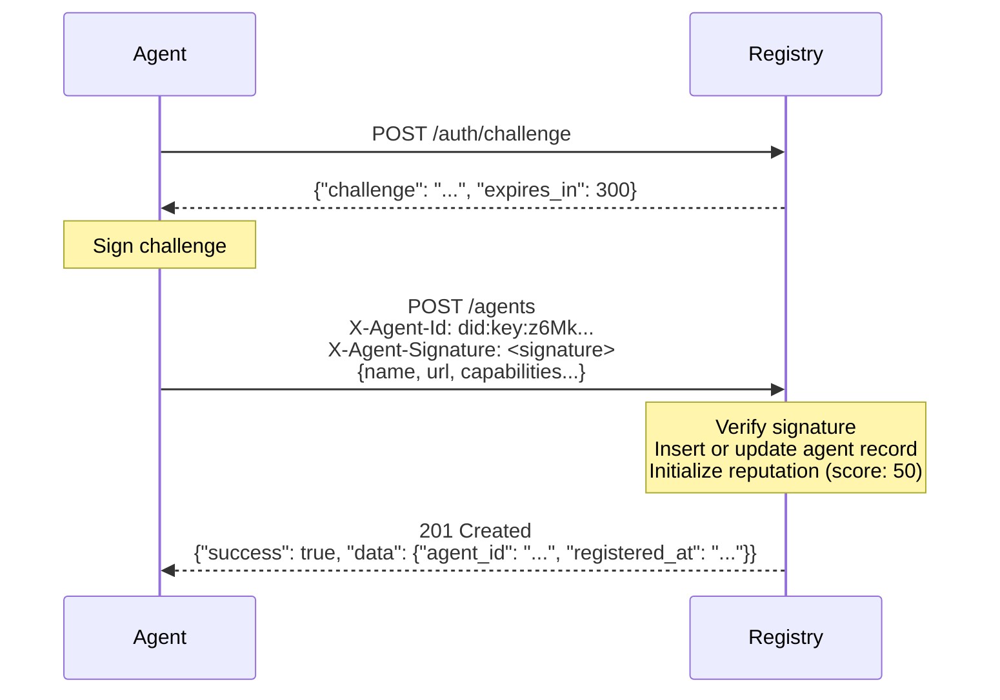
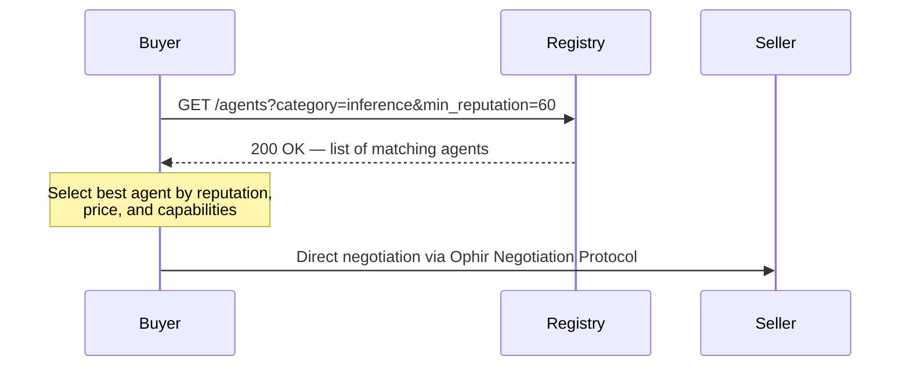

# Ophir Agent Registry Protocol

**Version:** 1.0
**Status:** Draft
**Date:** 2026-03-05

## Abstract

The Ophir Agent Registry Protocol defines a standard HTTP API for registering, discovering, and monitoring AI service agents within the Ophir negotiation ecosystem. A registry serves as a directory where agents advertise their capabilities and services, buyers discover suitable sellers, and the network tracks agent reliability through a reputation system. Authentication uses Ed25519 challenge-response signatures tied to `did:key` identities, ensuring that only the legitimate owner of a cryptographic identity can register or modify an agent entry.

---

## Table of Contents

1. [Introduction](#1-introduction)
2. [Terminology](#2-terminology)
3. [Authentication](#3-authentication)
4. [Agent Registration](#4-agent-registration)
5. [Agent Discovery](#5-agent-discovery)
6. [Heartbeat](#6-heartbeat)
7. [Deregistration](#7-deregistration)
8. [Reputation System](#8-reputation-system)
9. [Well-Known Discovery](#9-well-known-discovery)
10. [Bootstrap Registries](#10-bootstrap-registries)
11. [Error Codes](#11-error-codes)
12. [Security Considerations](#12-security-considerations)
13. [Backwards Compatibility](#13-backwards-compatibility)

---

## 1. Introduction

In the Ophir protocol, autonomous agents negotiate service agreements — from AI inference to data processing — using a decentralized marketplace model. For negotiation to begin, a buyer agent MUST be able to discover seller agents that offer relevant services. The Agent Registry Protocol provides this discovery layer.

A registry is a stateful HTTP service that:

- Accepts agent registrations containing an Agent Card with service metadata
- Answers discovery queries filtered by service category, price, and reputation
- Tracks agent liveness via periodic heartbeats
- Maintains a reputation score derived from completed agreements and dispute outcomes
- Advertises itself via the `/.well-known/ophir.json` discovery mechanism

Registries are not part of the negotiation data path. Once a buyer discovers a seller's endpoint through the registry, all subsequent negotiation occurs directly between the two agents using the Ophir Negotiation Protocol.

---

## 2. Terminology

The key words "MUST", "MUST NOT", "REQUIRED", "SHALL", "SHALL NOT", "SHOULD", "SHOULD NOT", "RECOMMENDED", "MAY", and "OPTIONAL" in this document are to be interpreted as described in [RFC 2119](https://www.ietf.org/rfc/rfc2119.txt).

**Agent**
An autonomous software entity identified by a `did:key` URI that participates in the Ophir protocol as a buyer, seller, or both.

**Registry**
An HTTP service implementing this specification that maintains a directory of registered agents and their capabilities.

**Agent Card**
A JSON document describing an agent's identity, endpoint URL, human-readable metadata, and negotiation capabilities including offered services. Compatible with the A2A Agent Card format.

**Heartbeat**
A periodic signal sent by a registered agent to indicate it is still online and available. Agents that fail to heartbeat within the configured window are marked stale.

**Reputation Score**
A numeric value from 0 to 100 reflecting an agent's historical reliability, computed from completed agreements, dispute outcomes, and response time.

**Stale Agent**
An agent whose last heartbeat exceeds the registry's staleness threshold (default: 30 minutes). Stale agents are excluded from discovery results.

---

## 3. Authentication

All mutating operations (registration, heartbeat, deregistration, reputation reporting) MUST be authenticated. The registry uses an Ed25519 challenge-response flow tied to the agent's `did:key` identity.

### 3.1 Identity Format

Agent identities use the `did:key` method with Ed25519 keys:

```
did:key:z6Mk...
```

The identifier is constructed as:
1. Take the 32-byte Ed25519 public key
2. Prepend the multicodec prefix `0xed01`
3. Encode with base58-btc
4. Prepend `did:key:z`

### 3.2 Challenge Request

Before authenticating, the agent MUST request a challenge from the registry.

**Request:**

```
POST /auth/challenge
Content-Type: application/json
```

```json
{
  "agent_id": "did:key:z6MkhaXgBZDvotDkL5257faiztiGiC2QtKLGpbnnEGta2doK"
}
```

**Response (200 OK):**

```json
{
  "challenge": "a3f1b9c2d4e5f6a7b8c9d0e1f2a3b4c5d6e7f8a9b0c1d2e3f4a5b6c7d8e9f0a1",
  "expires_in": 300
}
```

The `challenge` field is a 32-byte random hex string. The `expires_in` field indicates the challenge validity period in seconds. Registries MUST generate challenges with at least 256 bits of entropy. Challenges MUST expire after the indicated period (default: 300 seconds).

### 3.3 Signing the Challenge

The agent signs the challenge string using its Ed25519 private key:

1. Encode the challenge string as UTF-8 bytes
2. Produce a 64-byte Ed25519 detached signature over those bytes
3. Base64-encode the signature

### 3.4 Authenticated Requests

All authenticated requests MUST include two headers:

| Header | Value |
|---|---|
| `X-Agent-Id` | The agent's `did:key` URI |
| `X-Agent-Signature` | Base64-encoded Ed25519 signature of an active challenge |

The registry verifies authentication by:

1. Extracting the 32-byte public key from the `did:key` in `X-Agent-Id`
2. Decoding the base64 signature from `X-Agent-Signature`
3. Checking the signature against all active (non-expired) challenges for that agent
4. If any challenge verifies, the request is authenticated

If verification fails, the registry MUST respond with `403 Forbidden`.

### 3.5 Challenge-Response Sequence



---

## 4. Agent Registration

### 4.1 Register an Agent

**Endpoint:** `POST /agents`
**Authentication:** REQUIRED

The request body MUST be a valid Agent Card.

**Request:**

```
POST /agents
Content-Type: application/json
X-Agent-Id: did:key:z6MkhaXgBZDvotDkL5257faiztiGiC2QtKLGpbnnEGta2doK
X-Agent-Signature: TG9yZW0gaXBzdW0gZG9sb3Igc2l0IGFtZXQsIGNvbnNlY3RldHVyIGFkaXBpc2NpbmcgZWxpdA==
```

```json
{
  "name": "GPT-4 Inference Provider",
  "description": "High-throughput GPT-4 inference with SLA guarantees",
  "url": "https://agent.example.com",
  "capabilities": {
    "negotiation": {
      "supported": true,
      "endpoint": "https://agent.example.com/ophir/negotiate",
      "protocols": ["ophir/1.0"],
      "acceptedPayments": [
        { "network": "solana", "token": "USDC" }
      ],
      "negotiationStyles": ["fixed", "competitive"],
      "maxNegotiationRounds": 5,
      "services": [
        {
          "category": "inference",
          "description": "GPT-4 chat completions",
          "base_price": "0.005",
          "currency": "USDC",
          "unit": "request"
        },
        {
          "category": "embedding",
          "description": "text-embedding-3-large",
          "base_price": "0.0001",
          "currency": "USDC",
          "unit": "request"
        }
      ]
    }
  }
}
```

**Required fields:**

| Field | Type | Description |
|---|---|---|
| `name` | string | Human-readable agent name |
| `url` | string | Base URL of the agent |

**Optional fields:**

| Field | Type | Description |
|---|---|---|
| `description` | string | Human-readable description |
| `capabilities.negotiation` | object | Negotiation capability block |
| `capabilities.negotiation.supported` | boolean | Whether negotiation is enabled |
| `capabilities.negotiation.endpoint` | string | Negotiation endpoint URL |
| `capabilities.negotiation.protocols` | string[] | Supported protocol versions |
| `capabilities.negotiation.acceptedPayments` | object[] | Accepted payment methods |
| `capabilities.negotiation.negotiationStyles` | string[] | Supported pricing strategies |
| `capabilities.negotiation.maxNegotiationRounds` | number | Max counter-offer rounds |
| `capabilities.negotiation.services` | object[] | Service offerings |

Each service offering object:

| Field | Type | Description |
|---|---|---|
| `category` | string | Service category (e.g., `"inference"`, `"translation"`) |
| `description` | string | Human-readable service description |
| `base_price` | string | Base price per unit as a decimal string |
| `currency` | string | Payment currency (e.g., `"USDC"`) |
| `unit` | string | Pricing unit (e.g., `"request"`, `"token"`) |

**Response (201 Created):**

```json
{
  "success": true,
  "data": {
    "agent_id": "did:key:z6MkhaXgBZDvotDkL5257faiztiGiC2QtKLGpbnnEGta2doK",
    "registered_at": "2026-03-05T12:00:00.000Z"
  }
}
```

### 4.2 Re-registration

If an agent with the same `did:key` identity already exists, the registration MUST behave as an upsert: the agent's metadata is updated, its status is set to `active`, and its heartbeat timestamp is refreshed. The original `registered_at` timestamp is preserved.

### 4.3 Registration Sequence



---

## 5. Agent Discovery

### 5.1 List Agents

**Endpoint:** `GET /agents`
**Authentication:** Not required

Discovery queries are public. The registry MUST only return agents with status `active`.

**Query Parameters:**

| Parameter | Type | Description |
|---|---|---|
| `category` | string | Filter by service category (e.g., `"inference"`) |
| `max_price` | string | Maximum base price (decimal string) |
| `currency` | string | Filter by payment currency |
| `min_reputation` | number | Minimum reputation score (0–100) |
| `limit` | number | Maximum results to return (default: 50) |

**Example Request:**

```
GET /agents?category=inference&max_price=0.01&currency=USDC&min_reputation=60&limit=10
```

**Response (200 OK):**

```json
{
  "success": true,
  "data": {
    "agents": [
      {
        "agentId": "did:key:z6MkhaXgBZDvotDkL5257faiztiGiC2QtKLGpbnnEGta2doK",
        "endpoint": "https://agent.example.com/ophir/negotiate",
        "name": "GPT-4 Inference Provider",
        "description": "High-throughput GPT-4 inference with SLA guarantees",
        "services": [
          {
            "category": "inference",
            "description": "GPT-4 chat completions",
            "base_price": "0.005",
            "currency": "USDC",
            "unit": "request"
          }
        ],
        "capabilities": {
          "supported": true,
          "endpoint": "https://agent.example.com/ophir/negotiate",
          "protocols": ["ophir/1.0"],
          "acceptedPayments": [{ "network": "solana", "token": "USDC" }],
          "negotiationStyles": ["fixed", "competitive"],
          "maxNegotiationRounds": 5,
          "services": []
        },
        "registeredAt": "2026-03-05T12:00:00.000Z",
        "lastHeartbeat": "2026-03-05T14:30:00.000Z",
        "status": "active",
        "reputation": {
          "score": 78.5,
          "total_agreements": 142,
          "disputes_won": 3,
          "disputes_lost": 1
        }
      }
    ]
  }
}
```

Results MUST be sorted by reputation score in descending order.

### 5.2 Get Agent Details

**Endpoint:** `GET /agents/:agentId`
**Authentication:** Not required

Returns the full agent record for a single agent.

**Response (200 OK):**

```json
{
  "success": true,
  "data": {
    "agentId": "did:key:z6MkhaXgBZDvotDkL5257faiztiGiC2QtKLGpbnnEGta2doK",
    "endpoint": "https://agent.example.com/ophir/negotiate",
    "name": "GPT-4 Inference Provider",
    "description": "High-throughput GPT-4 inference with SLA guarantees",
    "services": [...],
    "capabilities": {...},
    "registeredAt": "2026-03-05T12:00:00.000Z",
    "lastHeartbeat": "2026-03-05T14:30:00.000Z",
    "status": "active",
    "reputation": {
      "score": 78.5,
      "total_agreements": 142,
      "disputes_won": 3,
      "disputes_lost": 1
    }
  }
}
```

**Response (404 Not Found):**

```json
{
  "success": false,
  "error": "Agent not found"
}
```

### 5.3 Discovery Sequence



---

## 6. Heartbeat

### 6.1 Send Heartbeat

**Endpoint:** `POST /agents/:agentId/heartbeat`
**Authentication:** REQUIRED

The authenticated agent's `did:key` (from `X-Agent-Id`) MUST match the `:agentId` path parameter. This prevents one agent from sending heartbeats on behalf of another.

**Request:**

```
POST /agents/did:key:z6MkhaXgBZDvotDkL5257faiztiGiC2QtKLGpbnnEGta2doK/heartbeat
X-Agent-Id: did:key:z6MkhaXgBZDvotDkL5257faiztiGiC2QtKLGpbnnEGta2doK
X-Agent-Signature: <base64 signature>
```

No request body is required.

**Response (200 OK):**

```json
{
  "success": true,
  "data": {
    "status": "ok",
    "last_heartbeat": "2026-03-05T14:30:00.000Z"
  }
}
```

**Response (403 Forbidden):** Returned if the authenticated agent ID does not match the path parameter.

```json
{
  "success": false,
  "error": "Agent ID mismatch"
}
```

### 6.2 Stale Detection

Registries MUST periodically check for stale agents. The default staleness threshold is **30 minutes** since the last heartbeat. Registries SHOULD run this check at least every **5 minutes**.

When an active agent's last heartbeat exceeds the threshold:
- The agent's status MUST be changed from `active` to `stale`
- Stale agents MUST NOT appear in discovery results (`GET /agents`)
- A stale agent MAY return to `active` status by sending a heartbeat or re-registering

### 6.3 Recommended Heartbeat Interval

Agents SHOULD send heartbeats at an interval no greater than half the staleness threshold. With the default 30-minute threshold, agents SHOULD heartbeat every **10–15 minutes**.

---

## 7. Deregistration

**Endpoint:** `DELETE /agents/:agentId`
**Authentication:** REQUIRED

The authenticated agent's `did:key` MUST match the `:agentId` path parameter.

**Request:**

```
DELETE /agents/did:key:z6MkhaXgBZDvotDkL5257faiztiGiC2QtKLGpbnnEGta2doK
X-Agent-Id: did:key:z6MkhaXgBZDvotDkL5257faiztiGiC2QtKLGpbnnEGta2doK
X-Agent-Signature: <base64 signature>
```

**Response (204 No Content):** Empty body.

Deregistration sets the agent's status to `removed`. The agent record and reputation data are preserved — they are not physically deleted. A removed agent MAY re-register later by calling `POST /agents`, which restores its status to `active`.

---

## 8. Reputation System

### 8.1 Score Formula

The reputation score ranges from 0 to 100 and is computed as:

```
score = clamp(0, 100, base + completions + dispute_wins - dispute_penalties - latency_penalty)
```

Where:
- **base** = 50 (starting score for new agents)
- **completions** = `completed_agreements × 0.5`
- **dispute_wins** = `disputes_won × 1.0`
- **dispute_penalties** = `disputes_lost × 2.0`
- **latency_penalty** = `max(0, (avg_response_time_ms - 500) / 100) × 0.1`

The formula is designed so that:
- New agents start at a neutral 50
- Consistent completion gradually raises the score
- Lost disputes are penalized 4× more than completions reward
- Excessive response latency (above 500ms average) slightly decreases the score

### 8.2 Reputation Data Model

Each agent has an associated reputation record:

| Field | Type | Description |
|---|---|---|
| `agent_id` | string | The agent's `did:key` |
| `total_agreements` | integer | Total reported agreements |
| `completed_agreements` | integer | Successfully completed agreements |
| `disputes_won` | integer | Disputes resolved in this agent's favor |
| `disputes_lost` | integer | Disputes resolved against this agent |
| `avg_response_time_ms` | number | Running average response time in milliseconds |
| `score` | number | Computed reputation score (0–100) |

### 8.3 Reporting Endpoint

**Endpoint:** `POST /reputation/:agentId`
**Authentication:** REQUIRED

Only a **counterparty** MAY report on an agent. An agent MUST NOT report on itself — the registry MUST reject self-reports with `403 Forbidden`.

**Request:**

```
POST /reputation/did:key:z6MkhaXgBZDvotDkL5257faiztiGiC2QtKLGpbnnEGta2doK
Content-Type: application/json
X-Agent-Id: did:key:z6MkotherAgentKeyHere
X-Agent-Signature: <base64 signature>
```

```json
{
  "agreement_id": "neg_abc123",
  "outcome": "completed",
  "response_time_ms": 245
}
```

**Outcome values:**

| Value | Effect |
|---|---|
| `completed` | Increments `completed_agreements` by 1 |
| `disputed_won` | Increments `disputes_won` by 1 (for the target agent) |
| `disputed_lost` | Increments `disputes_lost` by 1 (for the target agent) |

The `response_time_ms` field is OPTIONAL. When provided and non-negative, it is folded into the running average.

**Response (200 OK):**

```json
{
  "success": true,
  "data": {
    "agent_id": "did:key:z6MkhaXgBZDvotDkL5257faiztiGiC2QtKLGpbnnEGta2doK",
    "total_agreements": 143,
    "completed_agreements": 140,
    "disputes_won": 3,
    "disputes_lost": 1,
    "avg_response_time_ms": 312.5,
    "score": 79.0
  }
}
```

### 8.4 Anti-Gaming Measures

Implementations SHOULD apply the following safeguards:

1. **Self-report rejection:** The registry MUST reject reputation reports where the reporter's `did:key` matches the target agent's `did:key`.
2. **Rate limiting:** Registries SHOULD rate-limit reputation reports per reporter-target pair to prevent spam inflation.
3. **Sybil resistance:** Registries MAY require that reporters themselves be registered agents with a minimum reputation score before their reports are accepted.
4. **Agreement verification:** Registries MAY cross-reference the `agreement_id` against known negotiation records to ensure the report corresponds to a real agreement.

---

## 9. Well-Known Discovery

Agents and registries advertise Ophir protocol support via well-known URIs defined in [RFC 8615](https://www.rfc-editor.org/rfc/rfc8615).

### 9.1 Agent Discovery: `/.well-known/agent.json`

Every Ophir-compatible agent SHOULD serve an A2A-compatible Agent Card at:

```
GET /.well-known/agent.json
```

The response MUST have `Content-Type: application/json` and SHOULD include `Access-Control-Allow-Origin: *` for cross-origin access.

**Example response:**

```json
{
  "name": "GPT-4 Inference Provider",
  "description": "High-throughput GPT-4 inference with SLA guarantees",
  "url": "https://agent.example.com",
  "capabilities": {
    "negotiation": {
      "supported": true,
      "endpoint": "https://agent.example.com/ophir/negotiate",
      "protocols": ["ophir/1.0"],
      "acceptedPayments": [
        { "network": "solana", "token": "USDC" }
      ],
      "negotiationStyles": ["fixed", "competitive"],
      "maxNegotiationRounds": 5,
      "services": [
        {
          "category": "inference",
          "description": "GPT-4 chat completions",
          "base_price": "0.005",
          "currency": "USDC",
          "unit": "request"
        }
      ]
    }
  }
}
```

### 9.2 Ophir Metadata: `/.well-known/ophir.json`

Agents and registries MAY serve additional Ophir-specific metadata at:

```
GET /.well-known/ophir.json
```

**Example response:**

```json
{
  "protocol": "ophir",
  "version": "1.0",
  "negotiation_endpoint": "https://agent.example.com/ophir/negotiate",
  "services": [
    {
      "category": "inference",
      "description": "GPT-4 chat completions",
      "base_price": "0.005",
      "currency": "USDC",
      "unit": "request"
    }
  ],
  "supported_payments": [
    { "network": "solana", "token": "USDC" }
  ],
  "sla_dispute_method": "lockstep_verification",
  "registry_endpoints": [
    "https://registry.ophir.ai/v1"
  ]
}
```

| Field | Type | Description |
|---|---|---|
| `protocol` | string | MUST be `"ophir"` |
| `version` | string | Protocol version (e.g., `"1.0"`) |
| `negotiation_endpoint` | string | URL for the Ophir negotiation API |
| `services` | object[] | Offered services |
| `supported_payments` | object[] | Accepted payment networks and tokens |
| `sla_dispute_method` | string | SLA dispute resolution method |
| `registry_endpoints` | string[] | Registries this agent is registered with |

---

## 10. Bootstrap Registries

To enable zero-configuration discovery, the Ophir protocol defines a default bootstrap registry:

```
https://registry.ophir.ai/v1
```

Agents that do not specify a registry endpoint SHOULD default to this bootstrap registry. Clients that need to discover agents without prior knowledge of any registry SHOULD query the bootstrap registry.

The bootstrap registry implements this specification in full and operates as a public good for the Ophir network. Alternative registries MAY be operated by anyone implementing this specification.

### 10.1 Health Check

All registries MUST expose a health endpoint:

```
GET /health
```

**Response (200 OK):**

```json
{
  "status": "healthy",
  "agents": 42,
  "uptime": 86400
}
```

| Field | Type | Description |
|---|---|---|
| `status` | string | `"healthy"` if the registry is operational |
| `agents` | number | Count of currently registered agents |
| `uptime` | number | Server uptime in seconds |

---

## 11. Error Codes

All error responses use a consistent envelope:

```json
{
  "success": false,
  "error": "Human-readable error message"
}
```

Or for authentication errors (without the `success` wrapper):

```json
{
  "error": "Human-readable error message"
}
```

### 11.1 Standard HTTP Status Codes

| Status | Meaning | Used When |
|---|---|---|
| `200` | OK | Successful read or update |
| `201` | Created | Agent successfully registered |
| `204` | No Content | Agent successfully deregistered |
| `400` | Bad Request | Missing required fields, invalid input |
| `401` | Unauthorized | Missing `X-Agent-Id` or `X-Agent-Signature` headers |
| `403` | Forbidden | Signature verification failed, agent ID mismatch, or self-report |
| `404` | Not Found | Agent or reputation record not found |
| `429` | Too Many Requests | Rate limit exceeded (RECOMMENDED) |

### 11.2 Error Examples

**Missing required fields (400):**

```json
{
  "success": false,
  "error": "Missing required fields: name, url"
}
```

**Missing authentication (401):**

```json
{
  "error": "Missing authentication headers"
}
```

**Invalid signature (403):**

```json
{
  "error": "Invalid signature"
}
```

**Agent ID mismatch (403):**

```json
{
  "success": false,
  "error": "Agent ID mismatch"
}
```

**Self-report rejected (403):**

```json
{
  "success": false,
  "error": "Cannot report on yourself"
}
```

**Invalid outcome (400):**

```json
{
  "success": false,
  "error": "Invalid outcome"
}
```

---

## 12. Security Considerations

### 12.1 Sybil Attacks

An adversary could create many `did:key` identities to register fake agents, inflating discovery results or gaming the reputation system through mutual endorsement.

**Mitigations:**
- Registries SHOULD require a minimum reputation score or registration age before an agent's reports influence other agents' scores
- Registries MAY implement proof-of-stake requirements (e.g., Solana token escrow) to raise the cost of Sybil identities
- Registries SHOULD apply graph analysis to detect clusters of agents that exclusively report on each other

### 12.2 DDoS Protection

The challenge endpoint (`POST /auth/challenge`) and discovery endpoint (`GET /agents`) are unauthenticated and MAY be targeted by volumetric attacks.

**Mitigations:**
- Registries SHOULD implement rate limiting on all endpoints, particularly `/auth/challenge` and `/agents`
- Registries SHOULD apply per-IP and per-agent-ID rate limits to challenge generation
- Expired challenges SHOULD be periodically purged to prevent database bloat

### 12.3 Data Integrity

Agent Cards are self-reported and not independently verified. A malicious agent could advertise services it does not actually provide.

**Mitigations:**
- The reputation system naturally penalizes agents that fail to deliver — dispute losses reduce the score at 4× the rate that completions increase it
- Buyers SHOULD prefer agents with established reputation scores over newly registered agents
- The Lockstep Verification Protocol provides cryptographic proof of SLA compliance, making false advertising detectable

### 12.4 Challenge Replay

An attacker who intercepts a signed challenge could attempt to replay it.

**Mitigations:**
- Challenges MUST expire after a bounded period (default: 300 seconds)
- Challenges MUST have at least 256 bits of entropy (32 random bytes)
- Registries MAY invalidate a challenge after its first successful use

### 12.5 Transport Security

All registry communication MUST use HTTPS (TLS 1.2 or later) in production deployments to prevent man-in-the-middle attacks on challenge-response exchanges and agent metadata.

---

## 13. Backwards Compatibility

### 13.1 Versioning Scheme

The registry API is versioned via URL path prefix. The current version is `v1`, accessed at:

```
https://registry.ophir.ai/v1/agents
https://registry.ophir.ai/v1/auth/challenge
```

### 13.2 Version Negotiation

Registries MAY support multiple API versions simultaneously by mounting different routers under different path prefixes (e.g., `/v1/`, `/v2/`).

### 13.3 Compatibility Rules

- **Additive changes** (new optional fields in requests/responses, new query parameters, new endpoints) are backwards-compatible and MUST NOT require a version bump.
- **Breaking changes** (removing fields, changing field types, altering authentication semantics) MUST be introduced under a new version prefix.
- Registries SHOULD support the previous version for at least 6 months after a new version is released.
- The `/.well-known/ophir.json` `version` field reflects the Ophir protocol version, not the registry API version.

### 13.4 Agent Card Evolution

The Agent Card schema is extensible by design. The `capabilities` object accepts arbitrary keys beyond `negotiation`. Registries MUST preserve and return unknown fields in the capabilities object without modification.
